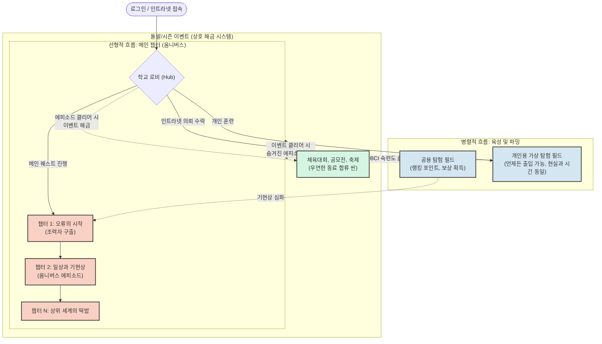

# (Legacy) System Data Spec & Properties

> **안내:** 이 문서는 과거 유니티 ScriptableObject(SO) 단위로 파편화되어 관리되던 기획 데이터 구조체들의 명세서입니다. 
> 현재는 에디터 복잡도를 낮추기 위해 코드 베이스에서 제거(.PrivateVault로 격리)되었으며, 앞으로 이 속성들은 **순수 기획서(Notion 등)나 JSON/Markdown 파일**로 옮겨서 관리하는 것을 권장합니다.

---

## 1. 캐릭터 & NPC 설정 (Character / NPC Data)

### 👤 NPC 프로필 및 프롬프트 설정 (`NPCData`)
LLM 프롬프트 생성 시 주입되던 NPC(괴이 등)의 고유 성격 및 페르소나 데이터입니다.
- **`npcId` / `npcName`**: 캐릭터의 고유 ID와 표출되는 이름
- **`mbtiType`**: 캐릭터의 성격 지표 (16가지 MBTI Enum)
- **`defaultMaskId`**: 기본 장착 탈(가면) ID
- **`personalityDescription`**: 고유 성격에 대한 상세 묘사
- **`speechStyle`**: 말투, 억양, 자주 쓰는 단어 등 언어적 특징
- **`promptInjection`**: LLM 프롬프트에 주입할 추가적인 지시문(Special Directives)

> **[기획 통합노트 참고: 3인 만담 캐릭터 컨텍스트]**
> * **플레이어 (Unknown)**: 시스템 데이터 외부의 관찰자. 빙의된 전교 꼴찌.
> * **도영 (수학/9등)**: 강박에 시달려 난해한 학술 용어를 방어기제로 두름. (예: "푸아송 분포를 따르는 발산 상태야")
> * **지민 (영어/중재자)**: 남의 갈등을 무마하려다 본심을 잃어버림. 도영의 외계어를 통역해주고 태클을 거는 역할.
> * **서무결 (보스/1등)**: 풀이 과정 없이 정답만 출력하는 인간 연산 기계. 백지화 기믹 사용.

### 🧬 캐릭터 외형 구조체 (`CharacterDNA`)
절차적으로 생성하거나 모듈화할 수 있는 캐릭터 외형(메시, 셰이더) 정보입니다.
- **`CharacterId`**: DNA 고유 식별자
- **`HeadMeshId`**: 장착할 머리/탈 메시 ID
- **`CapeLengthScale` / `SleeveWidthScale`**: 망토 길이 및 소매 폭 스케일 변수
- **`RimLightColor` / `FaceEmissiveColor`**: 외곽선 및 얼굴 발광 색상
- **`DecalTexture`**: 데칼 텍스처 (교복 메쉬 위에 스티커/명찰 덧붙임)

---

## 2. 가상 OS 앱 데이터 (Virtual OS Apps)

### 💬 메신저 데이터 (`SNSData`)
가상 OS의 SNS 앱에서 주고받을 알림 및 메시지 데이터 묶음입니다.
- **`senderName` / `profileImage`**: 발신자 이름 및 프로필 이미지
- **`messages`**: 순차적으로 출력될 텍스트 리스트
- **`unlockDiaryKeyword`**: 이 대화를 읽었을 때 다이어리 앱에 해금될 키워드

> **[기획 통합노트 참고: SNS 및 모의 스트리밍 피드]**
> * 교내 인트라넷/SNS 피드를 통해 퀘스트 단서(예: "도서관 2층 이상한 소리남") 제공.
> * 보스전 직후 방송 송출 시 가상의 청취자 댓글이 모의 라이브 스트리밍처럼 스크롤링됨.

### 🔖 북마크 데이터 (`BookmarkData`)
가상 OS 웹/다이어리 앱에서 표시될 콘텐츠 링크 정보입니다.
- **`title` / `description`**: 영상/글 제목 및 요약 설명
- **`thumbnail`**: 썸네일 이미지
- **`youtubeVideoID`**: 클릭 시 열릴 실제 유튜브 비디오 ID
- **`rewardID`**: 학습(시청) 완료 시 지급할 보상 ID

---

## 3. 기믹 및 성장 로직 데이터 (Mechanics)

### 🌳 튜터 스킬 트리 노드 (`TutorSkillNodeData`)
도움/힌트 시스템에서 해금되는 시너지 효과 트리입니다.
- **`requiredConcept`**: 스킬 해금에 필요한 선행 교과 개념
- **`prerequisites`**: 선행 스킬 노드 리스트
- **`effectType`**: `ApCostReduction` (AP 감소), `BonusDamage` (추가 피해), `UnlockDialogueBranch` (대화 분기 해금), `GrantSentenceItem` (단서 제공)
- **`effectValue` / `rewardSentenceItem`**: 스킬 위력 수치 및 보상 아이템

> **[기획 통합노트 참고: 조력자 스킬 (권능)]**
> * **도영 (수렴 값 고정)**: 폭주하는 수치와 난수를 한계값으로 강제 고정.
> * **지민 (직독직해/주파수 동기화)**: 적의 궤변을 무시하고 약점 파악 및 턴 순서 간섭.

---

## 4. 시나리오 흐름 제어 (Episode & Flow)

### 🎬 에피소드 노드 타입 (`EpisodeNodeType`)
1판의 흐름을 구성하는 단계별 노드 타입 Enum입니다.
- `PrologueVideo` (프롤로그 안내 영상)
- `SNSNotification` (SNS 알림 연출)
- `FieldExploration` (3D 맵 탐험 구역)
- `AnomalyEncounter` (괴이 조우 및 수학 기믹 전투)
- `BossDialogue` (미니보스 대화 및 결과 도출)

### 📚 과목 지배 속성 (`DominantSubject`)
스테이지나 노드에 걸리는 특정 과목 테마 속성입니다.
- `Math`, `English`, `Korean`, `Science`

> **[기획 통합노트 참고: 과목별 에피소드 테마]**
> * **수학 (무한과 극한)**: 무한 복도에 갇힌 9등 도영의 성적 강박. 극한/수렴 개념으로 해결.
> * **영어 (자막 없는 진심)**: 남의 감정만 오역하는 지민. 직독직해 스킬로 본심 파악.
> * **국어 (행간에 갇힌 독백)**: 시의 은유를 기계적으로 암기하다 감수성을 잃은 학생 구출.
> * **사회 (다수결의 감옥)**: 군중 심리 몬스터가 된 교실. 소수의 가치를 증명하는 큐시트로 통제 붕괴.


---

# [통합 기획 및 설계 문서 아카이브]

아래는 프로젝트의 핵심 철학, 내러티브, 그리고 시스템 구조가 담긴 세부 기획 문서들의 통합본입니다.


---

## [Confirmed] [StudyGame]_Banned_Words_Guideline.md


---

## [Confirmed] [StudyGame]_Banned_Words_Guideline.md.meta


---

## [Confirmed] [StudyGame]_Master_GDD.md


---

## [Confirmed] [StudyGame]_Master_GDD.md.meta


---

## [design] 01-core-loop.md.md

# 01_Game_Design_and_Loop (게임 디자인 및 핵심 루프)

## 1. 프로젝트 비전 (Vision)
* **슬로건:** "정답을 강요하는 세상에서, 정답으로 환산되지 않는 우리의 질문을 쏘아 올린다."
* **핵심 장르:** 학제 융합 심야 옴니버스 추론 RPG (Unity / UI Toolkit 기반)
* **콘셉트 지향점:** 단순 암기용 교육 게임을 탈피하여, 플레이어가 매일 접속하고 싶어하는 '내러티브성 지식 아카이브' 및 '도구/생산성 대시보드'로 기능합니다.
* **코어 테마:** 입시 지옥에서 정답으로 박제된 지식을, 학생들의 뒤틀린 사연을 풀어내는 '권능(Skill)'으로 복원합니다.

---

## 2. 핵심 게임플레이 루프 (Core Gameplay Loop)
게임의 기본 사이클은 **'교내 미스터리 추론'** 포맷으로 진행되며, 기존의 탐험·전투·추론이 조사·신호 정류·질문 주입이라는 서사적 행위와 1:1로 매칭됩니다.

### 단계별 흐름
1. **제보 접수 (에피소드 오픈):** 아지트로 학생들의 사연이나 괴담 제보(예: 3층 도서관 무한 통로 현상)가 들어옵니다.
2. **사전 추론 (오픈북 시험 준비):** 제보를 바탕으로 어떤 이상 현상과 수학적/학문적 개념이 등장할지 유추하고, 필요한 스킬과 '말 아이템'을 세팅합니다.
3. **현장 취재 (필드 탐색):** 이상현상 극장으로 변해버린 교내 시설로 출동해 왜곡 데이터와 단서('말 조각')를 수집합니다.
4. **노이즈 필터링 (전투 인터랙션):** 괴이(몬스터 큐브)와의 충돌은 물리적 전투가 아닌 '신호 정류(Tuning)' 작업입니다. 드래그 앤 드롭으로 주파수를 맞추고 수식을 보정합니다.
5. **질문 주입 및 모순 파쇄 (추론 세션):** 수집한 단서로 '질문 명제'를 조립하여 결계에 주입합니다. 정답 속 프레임(합리, 선동, 공감)에 따라 교내 반응과 여론이 달라집니다.
6. **영속성 아카이브 (다이어리/테이프):** 해결된 사건은 기록 테이프로 남고, 획득한 지식은 다이어리에 스크랩되어 실용적인 학습 노트로 기능합니다.

---

## 3. 핵심 메커니즘 (Key Mechanics)

### ① 말(문장) 아이템 인벤토리 (Dialogue Inventory)
* **개념:** 대화나 텍스트 파편을 물리적 아이템처럼 수집합니다.
* **구조:** 필드 탐색, 학생의 독백, SNS 피드 등에서 획득하며, 전투(노이즈 필터링)나 질문 조립 시 '소켓 아이템'으로 사용됩니다.

### ② 질문 조립기 (Question Synthesizer) & 질문 명제 조립
* **개념:** 보스전 클라이맥스 혹은 결계 해제 시 활용하는 UI 시스템입니다.
* **구조:** 
  - `[1. 프레임/전제]` + `[2. 수학/학문적 핵심 원리]` + `[3. 결론 및 종결]`
* **특징:** 정답(Fact)은 하나지만, 이를 감싸는 프레임(예: 합리주의, 오컬트 르포, 공감 위로)을 유저가 커스텀할 수 있어 플레이어만의 진행 스타일이 부여됩니다.
* **UI/커서 제어:** UI Toolkit 뷰 진입 및 드래그 앤 드롭 시 커서 조작은 `CursorManager`에 위임하며, 모달 전환 시 커서가 사라지거나 잠기는 경쟁 조건을 방지합니다.

### ③ 조력자 과외 및 스킬 시스템 (Tutor & Skill Graph)
* **개념:** 구출된 학생이 아지트의 조력자가 되며, 이들과의 대화(과외)를 통해 스킬 트리를 확장합니다.
* **구조:** 
  - 특정 학생과 심층 대화를 나눌수록(과외 단계 상승) 해당 과목의 응용 스킬이 해금됩니다.
  - 수학적 공식이나 학문적 원리가 단순 암기가 아닌, 물리/심리 법칙을 제어하는 '전투 스킬(권능)'로 활용됩니다. (예: 극한/수렴 -> 대상의 수치 고정)


---

## [design] 01-core-loop.md.md.meta

fileFormatVersion: 2
guid: c54580bb99b533748968d2ceb97ba39e
TextScriptImporter:
  externalObjects: {}
  userData: 
  assetBundleName: 
  assetBundleVariant: 


---

## [design] 02-system-structure.md

# [StudyGame] 세계관 및 전체 설정 구조 (Worldview & Structure)

## 1. 핵심 철학 (Core Philosophy)
전 과목을 포괄하는 교육 게임에서 가장 경계해야 할 위험은 '과목 간의 단절(선형적 강제)'과 '완전한 방치(자유도 과잉으로 인한 난이도/서사 붕괴)'입니다. 
지식은 단순 암기용 퀴즈나 점수 매기기용 도구가 아닌, 현실의 결함을 바로잡고 인간의 마음을 치유하는 '권능(Skill)'이자 '언어'로서 기능해야 합니다.

## 2. 세계관 및 배경 (Lore & Setting)
* **배후 조직 (학사 재단 비선 세력):**
  - 세계를 정복하려는 단순 악당 조직이 아닙니다. 실패와 불확실성을 극도로 두려워한 나머지, 모든 학생을 규격화된 '정답 기계'로 만들려는 학교의 거대한 '집단 방어기제'입니다.
* **이상현상 극장 (Anomaly Theater):**
  - 입시 경쟁과 억압된 감정이 임계점을 넘어 교내 시설을 뒤틀어버린 옴니버스 결계 공간입니다.
  - 이 공간의 보스들은 배후 조직의 획일화 시스템에 짓눌려 각기 다른 형태로 뒤틀려버린 **'불량품(희생자/부작용)'**들입니다.
* **구관 유휴 교실 (아지트):**
  - 공간 왜곡의 영향을 받지 않는 유일한 안전지대이자, 플레이어가 단서를 정리하고 조력자들과 교감하는 공간입니다.
* **주인공(플레이어)의 역할:**
  - 1학년 1학기 무단 장기 결석으로 전교 꼴찌 처리된 학생. 빙의 여부조차 본인과 주변 모두 알지 못하는 모호한(Unknown) 상태에서 정답 시스템의 데이터 관리 외 영역에 존재하는 질문자.

## 3. 옴니버스 에피소드 구조 (전 과목 포괄)
과목의 본질이 학생의 심리적 결핍과 1:1로 매칭되며, 전투 내 상태이상(디버프) 해제 등의 기믹으로 추상화됩니다(실제 시험지 풀이 배제).
* **Ep 1. 수학 (증명되지 않은 아이):** 전교 9등 도영의 성적 강박이 만든 '무한 수렴' 결계 정류.
* **Ep 2. 영어 (자막 없는 진심):** 타인의 감정만 오역하다 본심을 잃고 '인간 번역기'가 된 지민 구출.
* **Ep 3. 국어 (행간에 갇힌 독백):** 시의 은유를 기계적으로 암기하다 감수성을 잃은 학생 구출 (텍스트 이면 파악 기믹).
* **Ep 4. 사회 (다수결의 감옥):** '정상'이라는 기준에 맞추려다 군중 심리 몬스터가 된 교실 정류.
* **Ep 5. 역사 (지워진 오답 노트):** 과거의 부끄러운 실패를 지우려다 시간의 굴레에 갇힌 학생 구출.
* **Ep 6. 과학 (고립된 엔트로피):** 타인과의 마찰을 피하려 절대 영도의 궤도에 고립된 학생 구출.
* **Ep 7. 통합 (제0시험장):** 융합 스킬을 통한 최종 코어 제압.

## 4. 최종 보스 서사: 서무결 (전교 1등)
* **인물 설정:** 배후 조직의 통제 실험이 낳은 유일한 완성작이자 인간 연산 코어. 풀이 과정 없이 정답만을 출력하는 기계.
* **공포의 본질:** 9등 도영이 느끼는 공포는 단순한 성적 열등감이 아니라, 인간의 이성과 노력(풀이 과정)이 정답만을 출력하는 텅 빈 기계 앞에서 무가치해지는 '노력의 부정'입니다.
* **최종 클라이맥스 (질문 조립기):**
  - 무결은 플레이어의 모든 논리와 스킬을 "오답, 무효" 처리하며 '백지화'합니다.
  - 이를 깨는 방법은 더 완벽한 공식이 아니라, 보스가 연산할 수 없는 '대답할 수 없는 질문(모순)'을 던져 무한 루프(NaN) 에러를 일으키는 것입니다.
* **결론:**
  - 무결을 쓰러뜨려야 할 적이 아닌, **'가장 먼저 정답의 감옥에 갇혔던 첫 번째 피해자'로 구원해 냄으로써 교육과 인간성의 본질을 하나로 꿰뚫을 수 있습니다.**

## 5. UI 시스템 및 커서 상태 아키텍처 (UI & Cursor Architecture)
* **Single Source of Truth (SSOT):** 게임 내 커서 상태(`UnityEngine.Cursor.visible`, `UnityEngine.Cursor.lockState`)는 오직 `CursorManager` 클래스를 통해서만 관리됩니다.
* **모달 UI 동기화:** 질문 조립기, 다이어리, 설정 등 UI Toolkit 기반 모달 UI는 열림/닫힘 시 `CursorManager.Instance.RegisterModalOpen()` / `RegisterModalClose()`를 호출하여 개별 스크립트 간 커서 가시성 제어 충돌을 방지합니다.
* **Unity 6000.0 네임스페이스 규칙:** `UnityEngine.UIElements.Cursor`와의 충돌을 방지하기 위해 C# 하드웨어 커서 조작 코드는 `UnityEngine.Cursor` 명칭을 명시합니다.

---

## [design] 02-system-structure.md.meta

fileFormatVersion: 2
guid: d2da6efc61b1d5f4eb3c22ade236f555
TextScriptImporter:
  externalObjects: {}
  userData: 
  assetBundleName: 
  assetBundleVariant: 


---

## [design] 03-character-customize-artstyle.md

당신은 Unity/C# 기반 상용 게임 클라이언트 아키텍트이자 테크니컬 아티스트(TA)입니다.
무거운 외부 플러그인(UMA 등)을 배제하고, 닌텐도 Mii 스타일의 파라미터 조합 방식을 적용한 **'경량화된 3D 아바타 커스터마이징 및 렌더링 시스템'**을 구현하려 합니다. 프로젝트의 UI는 모두 UI Toolkit을 사용하며, 커서 제어는 전역 `CursorManager`를 통제점(SSOT)으로 사용합니다.

[캐릭터 비주얼 및 렌더링 핵심 요구사항]

1. 스파이더맨 뉴 유니버스 스타일 (Borderless Toon): 아웃라인(외곽선) 없이 명암의 경계(Hard Step)와 빛나는 가장자리(Outer/Inner Rim Light)만으로 칠흑 같은 공허(Void) 실루엣 안에서 옷의 주름과 형태감(Volume)을 입체적으로 표현합니다.
2. 부유하는 표정 (Depth & Emissive): 눈/입 파츠는 바디 메쉬 위에 겹쳐지며, 셰이더의 Depth Offset을 통해 메쉬에 파묻히지 않고 복면처럼 딱 붙어 있게 합니다. 강력한 Emissive를 적용해 팝아트적으로 빛나게 만듭니다.
3. 역동적인 형태선 (Dynamic Movement): 캐릭터가 이동하거나 애니메이션을 재생할 때, 머리카락 덩어리나 후드 망토(Cape) 자락이 물리적으로 찰랑거리며 살아 움직여야 합니다. (경량화된 SpringBone 또는 WiggleBone 스크립트를 런타임에 동적 할당)

[커스터마이징 조립 핵심 요구사항]

1. 헤드(머리) 조합: 기본 입체 도형과 각종 파츠(뿔, 고양이 귀 등)의 위치/크기/회전값을 조절하여 오브젝트 헤드를 생성합니다.
2. 의상 형태 조절: 교복, 우주복, 신전 사제풍 후드 케이프 등을 제공하며, Bone Scaling 및 BlendShape을 통해 옷의 길이나 폼(핏)을 슬라이더로 조절합니다.
3. 스티커/데칼 시스템: 교복 메쉬 위에 유저가 원하는 명찰, 거친 낙서 텍스처를 덧붙입니다. (Runtime Texture Blending 또는 Shader Decal 활용)

[작업 지시 사항: 다음 5가지 핵심 모듈을 C# 스크립트 및 셰이더 가이드로 작성해주세요]

1. 데이터 모델: CharacterDNA.cs (ScriptableObject 및 JSON 직렬화 지원)
   - 파츠 정보 (Head Primitives 배열: Mesh ID, Transform, Color)
   - 의상 정보 (Costume ID, Cape Length Scale, Sleeve Width Scale 등)
   - 렌더링 & 데칼 (DecalData 배열, Face Emissive Color, Rim Light Color)

2. 런타임 조립기: AvatarAssembler.cs
   - [핵심 로직] SkinnedMeshRenderer의 `bones` 배열을 순회하여 공통 Humanoid 뼈대(Base Rig)에 재할당(Rebind)하는 로직.
   - DNA 파라미터를 읽어 의상 Bone의 `localScale`을 변경.
   - [물리 적용] 조립 완료 후, 이름에 "Hair*" 또는 "Cape*"가 포함된 Bone을 찾아 경량 물리 스크립트(가칭 `LightweightSpringBone.cs`)를 자동 부착하고 세팅하는 로직.
   - MaterialPropertyBlock을 통해 기본 재질에 데칼 배열과 Emissive/Rim 색상을 오버레이.

3. 랜덤 생성 및 데칼 제어기: CustomizationManager.cs
   - NPC 양산을 위한 무작위 DNA 생성(Randomize) 및 오컬트 콘셉트에 맞춘 기하학적 형태 제약(Constraint) 로직.

4. UI Toolkit 커스텀 에디터 뷰: CustomizationUI.cs
   - 좌측: 3D 캐릭터 렌더링 뷰 / 우측: Mii 방식의 파라미터 슬라이더 패널.
   - [규칙 엄수] 해당 모달 UI 오픈/클로즈 시 `CursorManager.Instance.RegisterModalOpen()` 및 `RegisterModalClose()`를 호출하여 커서 가시성을 관리하세요. 내부에서 `UnityEngine.Cursor.visible` 직접 조작 절대 금지.
   - 네임스페이스 모호성 방지를 위해 `UnityEngine.Cursor` 타입을 명확히 기재하세요.

5. 셰이더 가이드: BorderlessVoidToon.shader (HLSL 또는 Shader Graph 구조 설명)
   - 아웃라인 없이 Dot(N, L) 기반의 칼같은 명암 분리(Cel Shade).
   - Fresnel 기반 Rim Light 처리 및 Depth Offset을 이용한 표정(Face) 렌더링 구조 작성.

모바일 및 PC 크로스 플랫폼 성능을 고려하여 GC 발생을 최소화하고, 재질 인스턴싱 대신 PropertyBlock을 적극 활용해 주십시오. 1번 데이터 모델부터 순차적으로 코드를 출력해 주십시오.


---

## [design] 03-character-customize-artstyle.md.meta

fileFormatVersion: 2
guid: 4c0f59fe4a4d6c248bb356eaeafc4b5e
TextScriptImporter:
  externalObjects: {}
  userData: 
  assetBundleName: 
  assetBundleVariant: 


---

## [narrative] 01-lore.md

# 02_Worldview_and_Story (세계관 및 스토리 기획)

## 1. 세계관 배경 (Background Lore)

### 이상현상 극장 (Anomaly Theater)
* **개념:** 극단적인 입시 경쟁, 불안, 억압된 감정이 임계점을 돌파해 교내 특정 시설(시계탑, 도서관, 어학실 등)을 비틀어버린 결계 공간입니다.
* **특징:** 이 안에 갇힌 학생들은 자아를 방어하기 위해 '말을 잃은 인형'이나 정해진 배역만을 반복하는 'NPC'처럼 행동합니다.
* **오컬트적 분위기:** 수학/학술적 개념이 물리적 기믹(무한 복도, 비유클리드 공간 등)으로 치환되어 괴기스러운 연출을 보여줍니다.

### 구관 유휴 교실 (아지트)
* **역할:** 공간 왜곡의 영향을 받지 않는 유일한 안전지대입니다.
* **기능:** 플레이어가 수집한 단서를 정리하고, 구출된 조력자와 대화(과외)하며, 다이어리를 꾸미고 다음 질문 조립을 준비하는 '서재형 대시보드' 공간입니다.
* **UI/커서 제어:** 아지트 내 모달 패널(과외, 다이어리 등) 열림 시 `CursorManager`를 통해 커서를 유저 조작 가능 상태로 제어합니다.

### 배후 조직 (학사 재단 비선 세력)
* **정체:** 단순한 악당이 아닌, 실패와 불확실성을 극도로 두려워한 학교의 거대한 '집단 방어기제'입니다.
* **목적:** 극단적 스트레스 환경에서 발생하는 '순수 지적 에너지'를 추출해 모든 학생을 규격화된 정답 기계로 만들고, 특권층을 위한 완벽한 통제 시스템을 구축하려 합니다.

---

## 2. 시나리오 및 에피소드 전개 기획 (옴니버스)

### 에피소드 구성 방식 (옴니버스 미스터리)
각 챕터는 하나의 이상현상 제보에서 시작하여 사건 해결 및 질문 주입으로 마무리되는 독립된 옴니버스 형식으로 구성됩니다. 매 챕터는 특정 과목/개념과 학생의 사연이 깊이 결합되어 있습니다.

### 과목별 테마 및 사연 모티브 (기획 예시)
교과서 속 인물이나 개념이 겪었던 역사적 고민을 현대 학생의 결핍으로 재해석합니다.

1. **수학 (무한과 극한):** 
   - **사연 모티브 (칸토어):** "내 외로움의 크기는 남들과 차원이 다르다."
   - **상황:** 끊임없이 팽창하는 무한 복도에 스스로를 가둔 학생. 아무리 다가가도 거리가 줄어들지 않는 이상현상 발생.
   - **해결/결계 해제:** 극한과 수렴의 개념을 활용해 폭주하는 거리를 고정시키고, 끝없는 경쟁 속에서 수렴해야 할 '나만의 한계값'을 제시.

2. **사회/윤리 (공리주의):**
   - **사연 모티브 (벤담/밀):** 모두를 만족시키려다 자아를 잃어버린 학급 반장.
   - **상황:** 다수결의 원칙에 따라 소수의 의견이 물리적으로 '삭제'되는 교실 결계.
   - **해결/결계 해제:** 정답으로 환산할 수 없는 소수의 가치를 증명하는 질문을 주입하여 기계적 통제를 붕괴.

3. **국어/문학 (맥락과 해석):**
   - **사연 모티브:** 남의 기대에 맞춰 자신의 진짜 감정을 은유와 거짓으로만 표현하는 학생.
   - **상황:** 모든 대화 텍스트가 암호화되거나 왜곡 번역되는 공간.
   - **해결/결계 해제:** 직독직해와 맥락 파악 스킬로 본심을 찾아내어, 오답으로 여겨지던 감정을 긍정함.

### 플레이어의 스탠스와 멀티 엔딩적 요소
* 플레이어는 정답이 아닌 질문을 주입하지만, 질문 조립의 프레임(합리주의, 선동, 공감)에 따라 교내 게시판의 여론, SNS 댓글, NPC의 향후 태도가 달라지며, 이는 비동기식으로 다른 유저의 환경 노이즈에 반영되기도 합니다.


---

## [narrative] 01-lore.md.meta

fileFormatVersion: 2
guid: e85ccc294c0db4f41b929bf97c527b27
TextScriptImporter:
  externalObjects: {}
  userData: 
  assetBundleName: 
  assetBundleVariant: 


---

## [narrative] 02-characters.md

# 03_Characters_and_Interactions (캐릭터 및 대화 상호작용)

## 1. 핵심 등장인물 (Characters)

### ① 플레이어 (Unknown / 전교 꼴찌)
* **신분:** 1학년 1학기 무단 장기 결석으로 성적 미산출(전교 꼴찌) 처리된 1학년 학생.
* **정체 (Unknown):** 플레이어가 이 학생의 몸에 빙의한 듯한 이질감을 느끼지만, 실제 빙의된 것인지 무엇인지 플레이어 본인도 주변 인물도 모르는 모호한 상태.
* **포지션:** 모든 정답을 아는 구원자가 아닌, 시스템 데이터 관리에 잡히지 않는 유일한 존재로서 결계에 '질문'을 던지는 인물.
* **전투 역할:** 조력자들의 스킬과 수집한 '말 아이템'을 조합해 궤변과 이상현상에 '물음표(?)'를 던집니다.
* **특징:** 질문 조립 방식에 따라 합리적 분석가, 자극적 고발자, 따뜻한 위로가 등으로 성향(Vector)이 변화합니다.

### ② 도영 (수학 담당 / 전교 9등)
* **결핍:** 전교 1등의 문턱에 매달린 극심한 강박. 불안할 때마다 방어기제로 난해한 전문 학술 용어를 외계어처럼 남발합니다.
* **고유 스킬:** **[수렴 값 고정 (Convergence Limit)]** - 폭주하는 수치와 난수를 특정 한계값으로 강제 고정.
* **성장 아크:** 무기로 쓰던 지식을 점차 소통의 도구로 전환하며, 후반부에는 "밑빠진 독에 물 붓기"처럼 직관적인 비유를 구사하게 됩니다.

### ③ 지민 (영어 담당 / 실전 소통파)
* **결핍:** 남들의 갈등을 무마하느라 정작 자신의 슬픔은 "I'm fine"으로 왜곡 번역하는 인물 ("Lost in Translation").
* **고유 스킬:** 
  - **[직독직해 (Syntax Override)]**: 적의 복잡한 궤변을 무시하고 약점을 직관적으로 파악.
  - **[주파수 동기화 (Frequency Sync)]**: 턴 순서 간섭 및 스킬 연계 타이밍 보정.
* **대화 역할:** 도영의 외계어에 핀잔을 주며 플레이어에게 통역해 주는 분위기 메이커. ("야, 그렇게 말하면 너만 알지!")

### ④ 서무결 (최종 보스 / 공리 시스템)
* **정체:** 배후 조직의 통제 실험이 낳은 최초의 완성작. 풀이 과정 없이 정답만을 출력하는 인간 연산 코어이자 진짜 전교 1등.
* **기믹:** **[백지화 (Blank OMR)]** - 정답 기반의 모든 논리 공격을 "오답/무효" 처리하여 삭제합니다.
* **공략법:** 정답이 존재하지 않는 인간적인 질문(모순, 감정)을 주입해 시스템을 '연산 불가(NaN)' 상태로 만들어 해방시켜야 합니다.
* **보스전 UI 구현 규칙:** 질문 조립기 및 보스전 UI 개발 시 `CursorManager`에 커서 조작 권한을 이관하여, 클라이맥스 UI 팝업 중 커서가 원인 없이 숨겨지는 현상을 방지합니다.

---

## 2. 3인 만담 (티키타카) 대화 시스템

### '대화 체인' 구조 (Dialogue Chain)
스토리 진행 중 발생하는 복잡한 학술적 설명이 플레이어에게 지적 피로도를 주지 않도록, 3인 체제의 만담(티키타카) 인터랙션을 지원합니다.

1. **설명 (도영):** 도영이 특정 현상에 대해 지나치게 어렵고 학술적인 전문 용어로 상황을 분석합니다.
2. **개입 (플레이어):** 플레이어가 "무슨 말인지 모르겠는데?", "쉽게 좀 말해봐" 등의 선택지를 고릅니다.
3. **요약 및 태클 (지민):** 지민이 도영에게 핀잔을 주며, 현상을 현실적이고 직관적인 비유로 즉시 요약해줍니다.

이 구조는 정보의 전달력을 높이면서도 캐릭터 간의 성격 차이를 극대화하고, 게임의 분위기를 환기시키는 역할을 합니다.

---

## 3. NPC 반응 엔진 (의도된 상호작용)
* 플레이어가 질문을 주입할 때 설정한 프레임(합리성, 선동, 공감) 벡터에 따라, 가상의 청취자/학생(NPC) 페르소나가 매칭되어 반응합니다.
* **합리성 위주 진행:** 시니컬한 우등생 NPC가 논리적 엄밀성을 칭찬.
* **공감/위로 위주 진행:** 지친 야간자습생 NPC가 위로받았다는 피드백.
* 단순한 정답/오답이 아닌 '진행 태도'에 반응하게 함으로써, 플레이어가 게임 세계와 유기적으로 소통하고 있다고 느끼게 만듭니다.


---

## [narrative] 02-characters.md.meta

fileFormatVersion: 2
guid: 7fdee4c86dece9b478b944b94cbeed8f
TextScriptImporter:
  externalObjects: {}
  userData: 
  assetBundleName: 
  assetBundleVariant: 


---

## [narrative] 03-scenario-dialogue.md

# [StudyGame] 마스터 기획서 및 세계관 바이블 (Master Design Document)

## 1. 게임 핵심 철학과 세계관 (Core Vision & Lore)

### 1.1. 핵심 철학

- **능력주의적 갈증과 획일화 비판:** 전 과목을 포괄하는 교육 게임에서 가장 경계해야 할 위험은 '과목 간의 단절'과 '방치'입니다. 지식은 점수 매기기용 도구가 아닌, 현실의 결함을 바로잡고 인간의 마음을 치유하는 '언어'이자 '권능'으로 쓰입니다.
- **시험지 UI의 완전한 배제:** 실제 시험지/지문을 읽고 푸는 시스템은 배제합니다. 과목의 학문적 본질(예: 국어의 이면 파악, 수학의 변량 통제)은 전투 내의 상태이상(디버프) 해제나 턴제 기믹으로 철저히 '추상화'됩니다.

### 1.2. 세계관 배경

- **배후 조직 (시스템):** 세계 정복을 노리는 악당이 아닙니다. 실패를 극도로 두려워한 나머지, 모든 학생을 규격화된 '정답 기계'로 만들려는 학교의 거대한 '집단 방어기제'입니다.
- **이상현상 극장 (Anomaly Theater):** 시스템의 압박과 억압된 감정이 교내 시설을 뒤틀어버린 결계 공간입니다. 각 옴니버스 에피소드의 보스들은 이 시스템에 짓눌려 각기 다른 형태로 뒤틀린 **'불량품(부작용)'**들입니다.
- **제0시험장과 서무결:** 이 모든 과정을 거쳐 자아를 잃고 감정이 거세된 유일한 성공작이자, '가장 불쌍한 최종 보스' 서무결(전교 1등)이 있는 최종 코어입니다.

---

## 2. 캐릭터 서사 및 3인 대화 체인 (Characters & Dynamics)

### 2.1. 플레이어 (DJ / 질문자)

모든 정답을 아는 구원자가 아닙니다. 사연을 모아 전파로 쏘아 올리고, 정답 없는 세상에 '대답할 수 없는 질문'을 던지는 심야 라디오 DJ입니다. 주인공이 대화를 주도하기보다, 조력자들의 티키타카를 이끌어내는 관찰자 포지션을 겸합니다.

### 2.2. 도영 (수학 / 전교 9등) - "방어기제로 두른 외계어"

- **결핍:** 전교 1등의 문턱에서 스스로를 증명하려는 강박. 불안할 때마다 난해한 학술 용어를 무기처럼 두릅니다.
- **시간이 지나며 변하는 대화 연출 (성장 체감):**
  - **[초반 - 강박]** 도영: "적대 개체의 행동 패턴은 푸아송 분포를 따르는 비주기적 발산 상태야." / 지민: "아오! 언제 때릴지 모르니까 피하라고 하면 되잖아!"
  - **[중반 - 번역 시도]** 도영: "위상수학적인 뫼비우스의 띠 구조... 그러니까, 안팎 구분이 없으니 어딜 공격해도 약점에 맞는다는 뜻이야."
  - **[후반 - 티키타카 역전]** 도영: "한마디로 '밑빠진 독에 물 붓기'야. 방어만 해." / 지민: "뭐야 서운하게. 엔트로피 어쩌고 하던 맛이 없잖아." / 도영: "시끄러워. 실전엔 정보 전달의 직관성이 생명인 걸 깨달았을 뿐이야."

### 2.3. 지민 (영어 / 실전 소통파) - "Lost in Translation"

- **사연과 결핍:** 타인의 갈등을 무마하는 '인간 번역기(중재자)'로 살며, 정작 자신이 아플 땐 "I'm fine"으로 오역해 진짜 마음을 잃어버린 핵인싸.
- **이상현상 극장 [바벨의 어학실]:**
  투명한 방음 부스 안. 지민은 입이 카세트테이프로 변한 인형이 되어, 시커먼 그림자들의 비명을 '듣기 좋은 자막(거짓말)'으로 실시간 오역해 쏘아 올리고 있습니다.
- **구출 기믹 (Phase 1~3):**
  1. 단서 수집: `[Sad=슬프다]`가 `[Sad=괜찮다]`로 강제 오역된 찢어진 단어장 획득.
  2. 조력자 협력: 지민이 쏘아내는 '거짓 자막(물리적 타격기)'을 도영의 `[수렴 값 고정]`으로 묶어 접근.
  3. 심리 해원: 마이크 코드를 뽑고, 인벤토리의 **[ 번역 생략 (Untranslated) ]** 말 아이템을 꽂아 넣음. "남의 말은 그만 번역해. 네 진짜 마음은 자막이 없어도 들리니까."
- **획득 스킬:** `[직독직해(복잡한 궤변/환영 스킵)]`, `[주파수 동기화(적과 아군의 턴 순서 강제 동기화)]`

---

## 3. 핵심 시스템 및 세부 기능 (Core & Granular Features)

### 3.1. 무기 디자인 및 액션 원칙 (학교폭력 모방 방지)

- 필드 실시간 액션 시 **현실의 학용품(가위, 커터칼, 볼펜 등)을 무기로 묘사하는 것을 절대 금지**합니다.
- 타격(핵 앤 슬래시) 모션은 허용하되, 무기는 '거대한 주파수 이퀄라이저 검', '공중에 뜬 마그네틱 테이프 채찍', '빛으로 이루어진 수학 기호' 등 추상적이고 비현실적인 판타지 형태로 설계합니다.

### 3.2. 전투 페이즈 3단계

- **[Phase 1] 필드 실시간 액션:** 단순 노이즈(잡몹)를 추상화된 액션 무기(주파수/빛)로 회피 및 타격 처리.
- **[Phase 2] 스킬 덱 턴제 전투:** 중/대형 이상현상과 충돌 시 UI Toolkit 화면으로 전환. 과목별 스킬 카드(디버프 해제, 턴 간섭 등)를 활용해 논리적 오류를 수정.
- **[Phase 3] 질문 조립기 (보스전 클라이맥스):**
  - 보스(서무결 등)가 플레이어의 논리 스킬을 '백지화(무효화)' 시킴.
  - 화면 중앙의 3슬롯 `[전제] + [모순] + [종결(물음표)]`에 필드에서 주운 '말 아이템(문장)'을 꽂아 넣음.
  - 조합 송출 시 보스의 연산 회로에 무한 루프(NaN) 에러를 일으켜 붕괴시킴.

### 3.3. 잔기능 및 메타 시스템 (Meta & UI/UX)

- **심야 라디오 제보 (SNS 피드 갱신):**
  - 화면 한쪽에 가상의 학교 인트라넷/SNS 피드 UI 존재. "도서관 2층에서 이상한 소리 남 ㅠㅠ" 같은 텍스트가 실시간 갱신되며 다음 퀘스트(에피소드)의 단서가 됨.
  - 보스전 직후 방송을 송출하면, "나만 불안했던 게 아니었네" 등 학생들의 실시간 반응(모의 라이브 스트리밍 댓글)이 스크롤링 됨.
- **아지트 상호작용 (Hideout):**
  - 구출된 NPC들이 아지트를 배회하며, 각자의 성격에 맞는 애니메이션 출력 (예: 도영은 칠판에 수식 적기, 지민은 카세트테이프 늘어뜨리기).
  - 플레이어가 다가가면 3인 티키타카 잡담(예: 라면 끓여 먹기, 시답잖은 농담) 이벤트 발생.
- **다이어리 및 보상 프리뷰 (Archive):**
  - 해결된 사건은 '카세트테이프' 오브젝트로 영구 저장되며, 클릭 시 당시 방송 오디오를 다시 들을 수 있음.
  - 다음 과외(멘토링) 진행 시 얻을 수 있는 스킬 트리가 우측 패널에 프리뷰 형태로 제공되어 목표 의식 부여.
  - 필드에서 줍는 '말 아이템'은 텍스트 파편 형태로 수첩(다이어리) 인벤토리에 물리적인 스크랩처럼 보관됨.

---

## 4. 아키텍처 및 구현 가이드라인 (Dev Rules)

- **UI Toolkit 사용:** UGUI를 최소화하고 UI Toolkit(UXML, USS)으로 다이어리, 인벤토리, 턴제 덱 전투 인터페이스를 구성한다.
- **커서 관리 단일 제어점 (Cursor SSOT):** 모든 UI 모달은 오픈/클로즈 시 `CursorManager.Instance.RegisterModalOpen/Close`를 사용해야 하며, 개별 UI 클래스에서 `Cursor.visible`을 직접 다루는 것을 금지한다.
- **Unity 6000.0 네임스페이스 모호성 방지:** `using UnityEngine.UIElements;` 환경에서 하드웨어 커서 조작 시 `UnityEngine.Cursor` 타입을 명시하여 `CS0104` 에러를 방지한다.
- **Data-Driven (데이터 주도 설계):** 캐릭터 대사, 말 아이템 텍스트, 에피소드 스폰 데이터는 하드코딩하지 않고 `ScriptableObject` 혹은 `JSON`으로 분리한다.
- **Persistence (영속성):** 조력자 구출 진척도, 다이어리 해금 상태, 인벤토리는 `SaveData` 클래스를 통해 관리하고 직렬화한다.


---

## [narrative] 03-scenario-dialogue.md.meta

fileFormatVersion: 2
guid: e0322072fc948e848bed9a4db0b6acc0
TextScriptImporter:
  externalObjects: {}
  userData: 
  assetBundleName: 
  assetBundleVariant: 


---

## [prompts] 01-agent-alignment.md.md

# [StudyGame] AI 에이전트 기획 이해도 점검표 및 가이드라인 (Agent Alignment Checklist)

이 문서는 AI 에이전트가 코드를 작성하거나 기획을 확장할 때, 프로젝트의 핵심 방향성을 잃지 않도록 돕는 절대적인 기준표입니다. 에이전트는 코드 작성 전 반드시 본 문서의 [패러다임 변화]와 [인지 체크리스트]를 숙지해야 합니다.

---

## 1. 기획 패러다임 변화 (Before vs. After)
초기 기획에서 현재 기획으로 넘어오며 변경된 핵심 사항들입니다. **과거의 기획(Before) 방향으로 코드를 작성하지 않도록 주의하세요.**

| 구분 | 폐기된 초기 기획 (Before) | **현재 확정된 기획 (After)** |
| :--- | :--- | :--- |
| **핵심 장르** | 단순 학습용 퀴즈/문제 풀이 게임 | **MZ세대를 위한 학제 융합 심야 옴니버스 추론 RPG** |
| **게임의 목적** | 지식을 외워 정답을 맞히고 스테이지 클리어 | **지식(언어)을 도구로 삼아 시스템의 오류를 찾고 학생들의 억압된 마음을 치유** |
| **풀이 메커니즘** | 실제 시험지/지문 형태의 UI 제공 및 퀴즈 풀이 | **실제 시험 풀이는 완벽히 배제(별도 프로젝트로 분리). 과목의 본질을 스킬 및 디버프 해제 기믹으로 추상화** |
| **서사 구조** | 매번 비슷한 악당 조직원과의 반복 전투 | **다양한 결핍을 겪는 학생들의 옴니버스 사연 -> 최종적으로 '정답 기계(무결)'라는 코어로 수렴하는 빌드업** |
| **전투 시스템** | 턴제 스킬 덱 전투 하나로 모든 걸 해결 | **[필드 실시간 액션(추상적/판타지 무기)] -> [턴제 덱 전투] -> [질문 조립기] 3단계로 분리** |
| **최종 보스 공략**| 더 완벽하고 어려운 수학/논리 공식으로 압도 | **보스가 연산할 수 없는 '대답할 수 없는 질문'을 조립해 시스템 에러(NaN) 유발** |

---

## 2. 에이전트 핵심 인지 체크리스트 (Agent Core Checklist)
AI 에이전트는 기능 구현 시 아래 항목들을 True로 가정하고 코드를 짜야 합니다. 

### A. 내러티브 및 캐릭터 이해도
- [ ] **도영(수학)의 설정:** 전교 1등이 아니라 '전교 9등'이며, 열등감을 숨기기 위해 어려운 외계어를 남발하는 방어기제를 가졌다. (후반부로 갈수록 직관적인 비유를 쓴다)
- [ ] **지민(영어)의 설정:** 단순 문법 봇이 아니라, 도영의 어려운 말을 번역해주는 '소통의 달인'이자 딴지 거는 역할이다. 정작 자기 마음은 번역하지 못하는 결핍이 있다.
- [ ] **무결(최종 보스)의 설정:** 옴니버스의 에피소드 중 하나가 아니라, 배후 시스템이 만들어낸 '가장 완벽한 정답 기계'이자 최종 코어다. 이전 에피소드들의 보스들은 시스템의 압박이 낳은 불량품(부작용)들이다.
- [ ] **대화의 구조:** 주인공이 모든 걸 주도하지 않는다. '학구파 조력자(어려운 말) -> 플레이어(이해 불가) -> 실전파 조력자(딴지 및 번역)'의 3인 티키타카로 굴러간다.

### B. 시스템, 전투 플로우 및 모방 위험 방지 (★중요)
- [ ] **과목별 기믹의 추상화 (시험지 배제):** 국어 과목의 '텍스트 이면 파악' 같은 요소는 실제 지문을 읽고 푸는 방식이 아니라, 턴제 전투 내의 '은폐된 상태이상(디버프) 해제' 등 전투 메커니즘으로 치환된다. 
- [ ] **무기 디자인 및 액션 원칙 (학교폭력 모방 방지):** 핵 앤 슬래시 타격 액션을 구현하되, 무기의 외형이 가위, 커터칼, 볼펜 등 현실의 학용품이어서는 절대 안 된다. '주파수 파동', '빛으로 된 수학 기호' 등 추상적이고 비현실적인 판타지 형태로 설계한다.
- [ ] **말(문장) 아이템 수집:** 플레이어는 필드에서 학생들의 억눌린 감정이 담긴 '텍스트 조각'을 아이템처럼 인벤토리에 수집한다.
- [ ] **질문 조립기 메커니즘:** 클라이맥스에서는 `[전제] + [모순] + [종결(물음표)]` 3개의 슬롯에 말 아이템을 끼워 맞춰 보스의 논리를 부순다.
- [ ] **진행 순서:** 하나의 에피소드는 반드시 `[탐색/제보 수집] -> [필드 실시간 액션] -> [스킬덱 턴제 전투] -> [질문 조립기(클라이맥스)] -> [방송 송출 및 아지트 일상]` 순서로 흐른다.

---

## 3. 코드 구현 시 아키텍처 규칙 (Architecture Guidelines)
- **UI 구현체:** UGUI가 아닌 **UI Toolkit (UIBuilder, USS, UXML)**을 최우선으로 사용하여 화면을 구성한다.
- **커서 및 모달 SSOT (Single Source of Truth):** 커서 가시성 및 잠금 상태 조작은 오직 `CursorManager`에 위임한다. 개별 UI View 클래스에서 `UnityEngine.Cursor.visible`을 직접 제어하지 않으며, 모달 UI 오픈/클로즈 시 `CursorManager.Instance.RegisterModalOpen()` / `RegisterModalClose()`를 호출한다.
- **Unity 6000.0 UI Toolkit 네임스페이스 규칙:** `using UnityEngine.UIElements;`가 포함된 스크립트에서 하드웨어 커서를 조작할 경우 `UnityEngine.Cursor` 타입을 명시하여 `CS0104 (Ambiguous reference)` 컴파일 에러를 방지한다.
- **데이터 주도 설계 (Data-Driven):** 캐릭터의 대사, 무기 이펙트 데이터, 에피소드 진행 등은 하드코딩하지 않고 반드시 `ScriptableObject`나 `JSON`으로 분리한다.
- **의존성 분리:** 전투 매니저(BattleManager)와 다이어리 매니저(DiaryManager)는 서로 직접 참조하지 않고, C# Event(Action) 또는 옵저버 패턴(R3 등)을 통해 통신한다.
- **영속성 (Persistence):** 다이어리 해금, 조력자 스킬 트리, 인벤토리는 `SaveData` 클래스를 거쳐 로컬/클라우드에 직렬화되어야 한다.
- **실험 및 검증 (Verification):** 모든 UI 구현 및 버그 수정 후 텍스트로만 성공을 주장하는 것은 금지된다. 반드시 Unity Editor Play 모드에서 시각적 캡처(MCP Screenshot) 및 런타임 동작을 직접 검증하여 결과를 증명한다.

---

## [prompts] 01-agent-alignment.md.md.meta

fileFormatVersion: 2
guid: 0b66ba2a5f1f05b489db9afd090e617e
TextScriptImporter:
  externalObjects: {}
  userData: 
  assetBundleName: 
  assetBundleVariant: 


---

## [prompts] 02-dev-implementation.md

````markdown
# [StudyGame] 라이브 서비스 구현 프롬프트 통합 명세서

당신은 Unity 및 C# 기반 게임 클라이언트 아키텍트입니다. 아래 명세된 각 파트의 프롬프트를 참고하여, 요구사항에 맞는 스크립트와 시스템 구조를 설계 및 구현해 주세요. 모든 UI는 `UI Toolkit`을, 비동기 및 이벤트 처리는 `UniTask` 또는 `R3`를 권장합니다.

[Unity 6000.0.62f1 UI Toolkit & Cursor Architecture Rules]
1. Cursor SSOT: 모든 UI 모달 및 화면 전환 시 `UnityEngine.Cursor.visible`이나 `lockState`를 직접 조작하지 마십시오. 반드시 싱글톤 `CursorManager.Instance.RegisterModalOpen()` / `RegisterModalClose()`를 호출해야 합니다.
2. UI Toolkit Namespace: `using UnityEngine.UIElements;` 사용 시 `UnityEngine.Cursor`와 `UnityEngine.UIElements.Cursor` 간의 충돌(`CS0104`)을 방지하기 위해 하드웨어 커서 제어 코드는 반드시 `UnityEngine.Cursor` 명칭을 명시하십시오.
3. Test Setup: UI 구현 완료 후 에디터 내에서 Play 버튼 클릭만으로 즉시 테스트 가능하도록 데이터 주도 로드 및 Null-Safety를 확보해야 합니다.

---

## 1. 코어 게임플레이 (Core Gameplay)

### 1-1. 3D 필드 이동 및 환경 상호작용 (PC & Mobile 크로스 플랫폼)

```text
Unity의 새 Input System을 활용하여 PC와 모바일 모두에서 쾌적하게 조작할 수 있는 3D 탑다운/쿼터뷰 플레이어 컨트롤러를 구현해주세요.
[요구사항]
1. 이동 로직: PC는 WASD 키보드 입력, 모바일은 On-Screen Virtual Joystick 입력을 받아 3D 공간(NavMesh 또는 CharacterController 기반)에서 플레이어를 이동시키세요.
2. 카메라 워크: Cinemachine을 사용하여 플레이어를 부드럽게 추적하는 3D 뷰 카메라를 세팅하세요.
3. 상호작용: IInteractable 인터페이스를 정의하고, 플레이어가 근처에 가면 PC는 상호작용 키(F), 모바일은 화면 내 팝업된 '상호작용 버튼'을 터치하여 이벤트를 실행(쪽지 읽기, 주파수 조작 등)하도록 제어기를 작성하세요.
```
````

### 1-2. 하이브리드 액션 전투 (타격, 슈팅, 패링)

```text
필드에서 벌어지는 실시간 하이브리드 액션 컨트롤러를 크로스 플랫폼(PC/Mobile)에 맞춰 구현해주세요.
[요구사항]
1. 원거리 사격: PC는 마우스 커서 방향, 모바일은 우측 조이스틱(Twin-stick 슈터 방식) 방향으로 투사체(주파수 빔)를 발사하며, 발사 시간에 비례해 차오르는 Overheat(과열) 게이지 시스템을 작성하세요.
2. 근접 타격 및 패링: 별도의 액션 버튼(PC: 우클릭, 모바일: 전용 스킬 버튼) 입력 시 '마이크 스매시' 히트박스를 생성합니다. 적의 텍스트 투사체가 닿기 직전에 발동되면 투사체를 적에게 반사(Reflect)하는 패링 로직을 추가하세요.
3. 스턴 판정: 반사된 투사체에 맞은 적의 상태를 'Stunned'로 변경하고, 스턴 상태의 적과 충돌하면 턴제 전투 진입 시 선제공격(Advantage) 상태를 전달하세요.

```

### 1-3. 턴제 덱 전투 스테이트 머신 및 UI Toolkit

```text
UI Toolkit 기반의 턴제 덱 전투 시스템을 위한 상태 머신(FSM)을 구현해주세요.
[요구사항]
1. BattleInit -> PlayerTurn -> EnemyTurn -> Resolution -> BattleEnd 상태를 제어하는 BattleManager를 작성하세요.
2. UI Toolkit을 사용하여 하단 핸드(Hand)에 스킬 카드를 생성하고, PointerDown/Move/Up (모바일 터치 이벤트 포함) 이벤트로 카드를 드래그하여 적(Enemy) 영역에 드롭하는 타겟팅 로직을 구현하세요.
3. 카드가 드롭되면 Resolution 상태로 진입하여 카드 데이터(ScriptableObject)에 정의된 버프/디버프 및 데미지 연산을 수행하세요.
4. UI Toolkit 입력 이벤트 처리 중 마우스 커서 제어가 필요한 경우, 직접 조작하지 않고 CursorManager에 위임하며 `UnityEngine.Cursor` 타입 명칭을 명확히 명시하세요.

```

### 1-4. 질문 조립기 보스전 (클라이맥스 퍼즐)

```text
보스전 클라이맥스 전용 '질문 조립기' 인터랙션을 UI Toolkit으로 구현해주세요.
[요구사항]
1. 화면 중앙에 전제, 모순, 종결을 의미하는 3개의 슬롯(VisualElement)을 배치하세요.
2. 하단 인벤토리 리스트에서 '말 아이템(SentenceItemData)'을 드래그해 각 슬롯에 꽂아 넣는(Snap) 로직을 구현하되, TagType이 일치할 때만 들어가도록 검증하세요. (모바일 드래그 앤 드롭 지원 필수)
3. '송출' 버튼 클릭 시 3개 슬롯의 조합을 보스의 약점 룰(ValidationRuleSO)과 대조하고, 일치할 경우 무한 루프 에러(NaN) 연출을 트리거하는 이벤트를 발행하세요.
4. 질문 조립기 UI 모달 오픈/클로즈 시 CursorManager.Instance.RegisterModalOpen() 및 RegisterModalClose()를 호출하여 커서 가시성을 레퍼런스 카운팅 방식으로 제어하세요. UI 내부에서 Cursor.visible을 직접 수정하지 마세요.

```

---

## 2. 메타 게임 및 아웃게임 (Meta & Out-game)

### 2-1. 인벤토리 및 스킬 로드아웃 매니저

```text
수집한 아이템과 전투용 스킬을 관리하는 로드아웃(덱 빌딩) 매니저를 작성해주세요.
[요구사항]
1. InventoryManager: 수집한 '말 아이템(문장)' 데이터를 리스트로 관리하고, 카테고리/태그별로 정렬하는 필터링 메서드를 구현하세요.
2. LoadoutManager: 플레이어가 해금한 전체 스킬 카드 중 최대 4개를 전투 프리셋으로 등록할 수 있는 UI 로직 및 데이터 관리(저장) 기능을 작성하세요.

```

### 2-2. 다이어리(도감) 아카이브 UI

```text
게임의 영속성 데이터를 기반으로 해금된 정보를 보여주는 다이어리 모달 창을 UI Toolkit으로 구현해주세요.
[요구사항]
1. 좌측 ScrollView에 전체 도감 데이터(DatabaseSO)를 리스트로 렌더링하고, 미해금 항목은 자물쇠 아이콘으로 마스킹하세요. (모바일 스와이프 스크롤 지원)
2. 리스트의 항목을 클릭하면 우측 디테일 패널에 상세 텍스트(개념 설명, 관련 사연)가 바인딩되도록 작성하세요.
3. 카세트테이프 아이콘 클릭 시 해당 에피소드의 오디오 클립을 재생하는 기능을 AudioManager와 연동하세요.
4. 다이어리 모달 열림/닫힘 시 CursorManager를 통해 모달 조작 상태를 등록/해제하여 커서 상태 충돌이 발생하지 않도록 구현하세요.

```

---

## 3. 내러티브 및 UI/UX (Narrative & UI)

### 3-1. 3인 릴레이 대화 분기 엔진

```text
다자간 티키타카가 가능한 노드 기반 릴레이 대화 시스템을 구현해주세요.
[요구사항]
1. 발화자, 대사, 선택지, 다음 노드를 포함하는 DialogueNode(ScriptableObject) 구조를 설계하세요.
2. 선택지 입력에 따라 A 캐릭터가 말하려다 B 캐릭터가 난입하는 등, 노드의 NextNode 포인터를 동적으로 교체할 수 있는 분기 제어기를 작성하세요.
3. UI Toolkit 텍스트 요소에 DOTween(또는 UniTask)을 사용해 텍스트 타이핑 이펙트를 적용하세요. 모바일 화면비에 맞춰 대화창 앵커와 여백이 유동적으로 반응해야 합니다.
4. 대화 모달 UI 활성화 시 CursorManager의 모달 상태를 갱신하여 텍스트 상호작용 중 커서 가시성을 보장하세요.

```

### 3-2. 모의 라이브 스트리밍 댓글 피드

```text
방송 송출 시 실시간으로 댓글이 올라오는 가상 스트리밍 채팅 UI를 구현해주세요.
[요구사항]
1. ChatCommentPoolSO에서 텍스트를 무작위로 가져와 VisualElement로 생성하세요.
2. 난수 딜레이를 두고 댓글이 큐(Queue)에 추가되며, 리스트 하단에 새 댓글이 추가될 때마다 전체 리스트가 부드럽게 위로 밀려 올라가는(Scroll Up) 레이아웃 애니메이션을 구현하세요.
3. 화면을 벗어난 최상단 댓글 Element는 Object Pool로 반환하여 기기 메모리를 최적화하세요.

```

---

## 4. 시청각 요소 (Audio & Visuals)

### 4-1. 통합 오디오 매니저

```text
배경음(BGM)과 효과음(SFX)을 통합 관리하는 AudioManager 싱글톤 컴포넌트를 작성해주세요.
[요구사항]
1. BGM과 SFX AudioSource를 분리하고, AudioMixer를 통해 마스터/BGM/SFX 볼륨을 독립적으로 제어하는 메서드를 구현하세요.
2. 필드 브금에서 전투 브금으로 넘어갈 때 심리스하게 크로스페이드(Crossfade)되는 코루틴/UniTask 연출을 작성하세요.

```

### 4-2. 포스트 프로세싱 및 글리치 트랜지션

```text
전투 진입이나 보스전 클라이맥스 연출에 사용할 화면 왜곡 효과를 제어하는 스크립트를 작성해주세요.
[요구사항]
1. Unity URP Volume/Post-Processing API를 제어하여 특정 이벤트 발생 시 Chromatic Aberration, Film Grain, Lens Distortion 수치를 DOTween으로 핑퐁/증감시키는 로직을 구현하세요. 모바일 성능을 고려해 품질 프로필(Quality Profile)을 분리할 수 있어야 합니다.
2. 전투 진입 시 화면이 지지직거리는 아날로그 노이즈/글리치(Glitch) 효과를 1.5초간 재생한 뒤 다음 씬(또는 UI 오버레이)을 로드하도록 타이밍을 맞추세요.

```

---

## 5. 데이터 인프라 및 라이브옵스 (Backend & LiveOps)

### 5-1. 세이브 데이터 및 클라우드 동기화

```text
유저의 진행 상태를 기기 로컬과 클라우드에 영속화하는 PersistenceManager를 구현해주세요.
[요구사항]
1. 해금된 스킬, 인벤토리 아이템, 다이어리 도감 ID, 과외 진척도를 포함하는 SaveData C# 클래스를 정의하세요.
2. Newtonsoft.Json을 사용해 비동기로 로컬 파일에 직렬화/역직렬화하는 기능을 작성하세요.
3. 향후 PlayFab 또는 Firebase 연동을 대비하여, Save/Load 인터페이스(ISaveStrategy)를 추상화해 두세요.

```

### 5-2. Addressables 기반 리소스 로더

```text
추가 에피소드나 리소스를 앱 업데이트 없이 원격으로 불러오는 OTA 패치 시스템을 구현해주세요.
[요구사항]
1. Unity Addressables API를 사용하여 원격 카탈로그를 확인하고, 다운로드해야 할 에셋 번들의 용량을 계산하여 UI에 로딩 바를 띄우는 로직을 작성하세요.
2. 다운로드가 완료된 후 특정 에피소드 씬이나 UI 에셋을 비동기로 로드(LoadAssetAsync)하여 인스턴스화하는 매니저 컴포넌트를 작성하세요.

```

---

## 6. 최적화 및 QA (Optimization & QA)

### 6-1. 통합 오브젝트 풀링 매니저

```text
GC(Garbage Collector) 스파이크를 방지하기 위한 범용 Object Pooling 매니저를 구현해주세요.
[요구사항]
1. 제네릭 타입(T)을 지원하여 GameObject(투사체, 파티클)뿐만 아니라 UI Toolkit의 VisualElement도 풀링할 수 있는 구조로 설계하세요.
2. Dictionary를 사용해 프리팹/타입별 풀을 관리하고, Get()과 Release() 메서드를 구현하세요.
3. 초기 씬 로드 시 설정된 개수만큼(Prewarm) 미리 할당해 두는 기능을 추가하세요.

```

---

## 7. 비즈니스 모델 및 규제 대응 (BM & Compliance)

### 7-1. IAP 및 상점 시스템

```text
Unity IAP를 활용한 인앱 결제 모듈 및 상점 UI 제어 로직을 작성해주세요.
[요구사항]
1. 유저가 '에피소드 패스'나 '스킨' 아이템의 구매 버튼을 누르면 Unity IAP 프로세스를 호출하는 결제 컨트롤러를 구현하세요.
2. 결제 완료 콜백(ProcessPurchase)이 떨어지면 서버(또는 로컬 SaveData)에 아이템 소유 권한을 갱신하고 상점 UI 상태를 '구매 완료'로 업데이트하세요.

```

### 7-2. 약관 동의 및 로그인 플로우

```text
게임 최초 실행 시 거쳐야 하는 컴플라이언스 및 로그인 프로세스 플로우를 구현해주세요.
[요구사항]
1. 시작 씬에서 '이용약관' 및 '개인정보 처리방침' 모달을 UI Toolkit으로 띄우고, 체크박스 동의를 받아야만 다음 단계(로그인)로 넘어가는 상태 머신을 작성하세요.
2. 로컬 캐시(PlayerPrefs)를 확인하여 이미 동의한 유저는 이 과정을 스킵하고 바로 구글/애플 자동 로그인을 시도하도록 로직을 분기하세요.

```

---

## 8. 기본 시스템 및 설정 (Basic Systems & Settings)

### 8-1. 디스플레이 및 해상도 매니저 (크로스 플랫폼 대응)

```text
PC 및 모바일 기기의 다양한 화면비와 성능을 관리하는 디스플레이 매니저를 구현해주세요.
[요구사항]
1. 해상도 설정: PC 환경을 위한 전체화면/창모드 전환 기능 및 드롭다운을 통한 해상도(Resolution) 변경 로직을 작성하세요.
2. 프레임 레이트 및 VSync: 모바일 배터리 최적화를 위한 30/60FPS 타겟 프레임 설정 기능과 PC를 위한 VSync On/Off 기능을 구현하세요.
3. Safe Area 대응: 모바일 환경의 노치(Notch) 및 펀치홀 디스플레이를 고려하여 UI Toolkit 요소들이 Safe Area 내부로 자동 리사이징/패딩되도록 제어하는 스크립트를 작성하세요.

```

### 8-2. 통합 설정 UI (Settings Modal)

```text
유저가 게임 내 설정을 조작할 수 있는 설정 모달 창을 UI Toolkit으로 구현해주세요.
[요구사항]
1. 오디오 패널: 마스터, BGM, SFX 볼륨을 조절할 수 있는 Slider UI를 만들고 AudioManager의 AudioMixer와 바인딩하세요.
2. 게임플레이 패널: 카메라 화면 흔들림(Camera Shake) 토글, 언어 변경(Localization), 텍스트 출력 속도 변경 기능을 구현하고 PlayerPrefs 또는 로컬 세이브와 연동하세요.
3. 조작 패널: PC용 키 바인딩 확인 탭과 모바일용 조이스틱 위치 좌우 반전(Left/Right handed) 토글 옵션을 추가하세요.
4. 설정 모달 오픈/클로즈 시 CursorManager에 모달 상태를 등록 및 해제하여 다른 UI 및 플레이어 조작과의 커서 경쟁 상태를 방지하세요.

```

---

### 8-3. UI 커서 제어 및 모달 시스템 아키텍처 (Cursor SSOT & Modal Guardrails)

```text
Unity 6000.0 UI Toolkit 환경에서 마우스 커서 소멸 및 모달 입력 경쟁 조건을 방지하는 아키텍처를 구현해주세요.
[요구사항]
1. Single Source of Truth: CursorManager 클래스를 커서 가시성(UnityEngine.Cursor.visible) 및 잠금 상태(UnityEngine.Cursor.lockState)의 단일 제어점으로 유지하세요. 개별 UI View 스크립트에서 Cursor 전역 상태를 직접 수정하는 것을 금지합니다.
2. 모달 동기화: UI Toolkit 기반 모달(질문 조립기, 다이어리, 설정 등)은 열릴 때 CursorManager.Instance.RegisterModalOpen(), 닫힐 때 RegisterModalClose()를 호출하여 레퍼런스 카운팅 방식으로 커서 상태를 제어하세요.
3. 네임스페이스 충돌 예방: UnityEngine.UIElements.Cursor 구조체와 UnityEngine.Cursor 클래스 간의 ambiguous reference(CS0104) 컴파일 에러를 방지하기 위해, 모든 커서 제어 코드에서는 타입명을 UnityEngine.Cursor로 명확히 명시하세요.
4. 테스트 검증성: TestSetupMenu 및 메뉴 명령을 통해 Play 버튼 클릭 한 번으로 모든 UI 모달 데이터가 자동 세팅되고, visual assertion(스크린샷)으로 검증 가능한 구조를 유지하세요.
```

---

## 9. 캐릭터 커스터마이징 및 아바타 시스템 (Character Customization & Avatar)

### 9-1. 캐릭터 DNA 데이터 모델

```text
'오컬트 익명 학생' 아트 스타일의 캐릭터 외형 정보를 직렬화된 ScriptableObject/JSON으로 관리하는 데이터 모델을 작성해주세요.
[핵심 제약]
- 눈/코/입이 없으며, 얼굴은 '오브젝트 헤드(모니터, 촛대, 꽃, 기하학적 도형 등)'로 대체됩니다.
- 감정 표현은 Bone 스케일링, 헤드 발광체(Emissive) 색상 변경, BlendShape로 제어합니다.
- 모든 의상(상/하의)은 단일 Humanoid 공통 뼈대를 공유합니다.
[요구사항]
1. CharacterDNA.cs를 ScriptableObject 및 JSON 직렬화를 모두 지원하도록 작성하세요.
2. Head Primitives 배열(각 도형의 Mesh ID, Position, Rotation, Scale, Color), Head ID, CostumeTop ID, CostumeBottom ID 등 파츠 식별자를 포함하세요.
3. 의상 형태 변형 파라미터(Cape Length Scale, Sleeve Width Scale 등), Emissive Color, Head BlendShape Value(0.0~1.0)를 포함하세요.
4. DecalData 배열(Texture ID, UV Offset, Scale, Rotation)을 포함하여 스티커/낙서 시스템을 지원하세요.
```

### 9-2. 런타임 아바타 조립기 (Shared Skeleton Rebind)

```text
공유 뼈대 기반의 런타임 메쉬 조립기를 작성해주세요. UMA 등 외부 플러그인을 사용하지 않고 직접 구현합니다.
[요구사항]
1. [핵심 로직] 머리, 상의, 하의 프리팹을 인스턴스화한 뒤, Base Skeleton의 Bone 계층 구조를 순회하여 각 파츠의 SkinnedMeshRenderer.bones를 공통 뼈대에 재할당(Rebind)하세요.
2. 조립 후 빈 원본 껍데기(Transform)는 파괴하여 하이어라키를 최적화하세요.
3. CharacterDNA의 파라미터를 읽어 특정 Bone의 localScale을 변경해 의상 길이/형태를 조절하세요.
4. MaterialPropertyBlock을 통해 Emissive Color, BlendShape 값 및 스티커/낙서(Decal 텍스처 배열) 오버레이를 적용하세요. Material 인스턴싱 대신 PropertyBlock을 사용하여 드로콜 및 GC를 최소화하세요.
```

### 9-3. NPC 양산 및 랜덤 생성 도구

```text
수백 명의 학생 NPC를 빠르게 양산하기 위한 시스템을 작성해주세요.
[요구사항]
1. CustomizationManager.cs: NPC 양산을 위한 '완전 무작위 DNA 생성(Randomize)' 기능을 구현하세요. 오컬트 콘셉트에 맞춰 기괴한 도형 헤드와 낙서가 조화롭게 나오도록 랜덤 값의 범위를 제한(Constraint)하는 로직을 포함하세요.
2. CharacterMassProducer.cs (EditorWindow): 파츠별 드롭다운 선택, '랜덤 생성(Randomize DNA)' 버튼, '프리팹으로 저장(Save as Prefab)' 기능을 포함하는 커스텀 에디터 창을 작성하세요.
```

### 9-4. 인게임 커스터마이징 UI (UI Toolkit)

```text
플레이어가 자신의 아바타를 커스터마이징하는 인게임 UI를 UI Toolkit으로 구현해주세요.
[요구사항]
1. 좌측: 3D 캐릭터 렌더링 뷰(회전 가능) / 우측: Mii 방식의 파라미터 슬라이더 패널(도형 위치/크기, 옷 길이, 낙서 부착 등).
2. [규칙 엄수] 모달 UI 오픈/클로즈 시 CursorManager.Instance.RegisterModalOpen() 및 RegisterModalClose()를 호출하여 커서 가시성을 관리하세요. UI 내부에서 UnityEngine.Cursor.visible을 직접 조작하는 것을 절대 금지합니다.
3. 네임스페이스 모호성 방지를 위해 커서 관련 코드 작성 시 UnityEngine.Cursor 타입을 명확히 기재하세요.
4. 모바일 터치 대응: 슬라이더 및 3D 뷰 회전이 터치 입력에서도 정상 동작하도록 PointerDown/Move/Up 이벤트를 처리하세요.
```

### 9-5. 2D 스탠딩 베이커 (대화 UI용 초상화 캡처)

```text
조립 완료된 3D 아바타를 2D 스탠딩 이미지로 캡처하는 유틸리티를 작성해주세요.
[요구사항]
1. 지정된 Orthographic 카메라로 아바타를 비추고, RenderTexture를 사용해 배경이 투명한 고해상도 PNG(2D 대화용 스탠딩)로 즉시 캡처하여 지정된 폴더에 저장하는 메서드를 구현하세요.
2. 에디터 및 런타임 양쪽에서 호출 가능하도록 작성하세요.
```


---

## [prompts] 02-dev-implementation.md.meta

fileFormatVersion: 2
guid: 06aad053af95c0840ac60c42ca8ebd07
TextScriptImporter:
  externalObjects: {}
  userData: 
  assetBundleName: 
  assetBundleVariant: 


---

## [prompts] 03-character-customize-artstyle.md

# [StudyGame] 캐릭터 커스터마이징 및 렌더링 시스템 명세서

## 1. 아트 스타일 핵심 콘셉트 (비주얼 렌더링)

### 캐릭터 비주얼 정체성: '오컬트 익명 학생'
- **등신 비율:** 7등신 데포르메 (스타일라이즈드 리얼).
- **얼굴 표현 방식 (하이브리드 지원):** 
  1. **오브젝트 헤드:** 모니터, 촛대, 꽃, 기하학적 도형 등의 입체 메쉬를 머리로 사용.
  2. **공허(Void) 실루엣:** 전통적인 눈/코/입이 배제된 칠흑 같은 그림자 실루엣. 후드, 망토, 스카프 등으로 머리와 목의 형태를 감싸 익명성을 극대화.
- **감정 표현 수단 (Depth & Emissive):** 
  - 빛나는 네온 이모티콘(눈, 입, '?' 등) 파츠가 바디 메쉬 위에 겹쳐지며, 셰이더의 **Depth Offset**을 통해 메쉬에 파묻히지 않고 복면처럼 밀착되어 표현됨.
  - 강력한 Emissive(발광)를 적용하여 팝아트적으로 빛나게 연출.
  - Bone 스케일링, 블렌드쉐이프(개화, 촛농 흐름 등) 병행 사용.
- **렌더링 스타일 (스파이더맨 뉴 유니버스 스타일 - Borderless Toon):**
  - 아웃라인(외곽선) 없이 명암의 경계(Hard Step)와 빛나는 가장자리(Outer/Inner Rim Light)만으로 실루엣 안에서 옷의 주름과 형태감(Volume)을 입체적으로 표현.
- **역동적인 형태선 (Dynamic Movement):**
  - 캐릭터가 이동하거나 애니메이션을 재생할 때, 머리카락 덩어리나 망토(Cape) 자락이 물리적으로 찰랑거리며 살아 움직임 (경량화된 SpringBone 활용).

---

## 2. 커스터마이징 시스템 설계 원칙

### 핵심 작동 원리
UMA와 닌텐도 Mii의 핵심 작동 원리인 **'공유 뼈대 기반 메쉬 조립'**과 **'DNA 파라미터 제어'**를 경량화된 커스텀 C# 스크립트로 직접 구현합니다. 무겁고 복잡한 외부 플러그인(UMA 등)은 사용하지 않습니다.

### 커스텀 요소 분류

#### ① 헤드(머리) 및 이모티콘 조합
- 기본 입체 도형과 각종 파츠(뿔, 고양이 귀 등)의 위치/크기/회전값을 세밀하게 조절하여 오브젝트 헤드를 생성.
- 또는 Void 얼굴 위에 Emissive 표정 파츠를 자유롭게 배치하여 감정 표현.

#### ② 의상 형태 조절
- 교복, 우주복, 신전 사제풍 후드 케이프 등 파츠 제공.
- 단순 파츠 교체뿐만 아니라 **Bone Scaling** 및 **BlendShape**을 통해 옷의 길이나 폼(핏)을 슬라이더로 조절.
- 상/하의는 단일 Humanoid 공유 뼈대 기반.

#### ③ 스티커/데칼 시스템
- 교복 메쉬 위에 유저가 원하는 명찰, 거친 낙서 텍스처를 덧붙임.
- Runtime Texture Blending 또는 Shader Decal 활용.

---

## 3. 핵심 모듈 구성 (5개 스크립트 및 셰이더)

### 3-1. 데이터 모델: CharacterDNA.cs (ScriptableObject & JSON 직렬화)
- 파츠 정보 (Head Primitives 배열: Mesh ID, Transform, Color).
- 의상 정보 (Costume ID, Cape Length Scale, Sleeve Width Scale 등).
- 렌더링 & 데칼 정보 (DecalData 배열, Face Emissive Color, Rim Light Color).

### 3-2. 런타임 조립기: AvatarAssembler.cs
- **[핵심 로직]** 머리, 상의, 하의 프리팹을 인스턴스화한 뒤, Base Skeleton의 Bone 계층 구조를 순회하여 각 파츠의 `SkinnedMeshRenderer.bones`를 공통 뼈대에 재할당(Rebind).
- DNA 파라미터를 읽어 의상 Bone의 `localScale`을 변경해 의상 길이 조절.
- **[물리 적용]** 조립 완료 후, 이름에 "Hair*" 또는 "Cape*"가 포함된 Bone을 찾아 경량 물리 스크립트(가칭 `LightweightSpringBone.cs`)를 자동 부착하고 세팅.
- `MaterialPropertyBlock`을 통해 기본 재질에 데칼 배열과 Emissive/Rim 색상을 오버레이 적용.

### 3-3. 랜덤 생성 및 데칼 제어기: CustomizationManager.cs & CharacterMassProducer.cs
- NPC 양산을 위한 무작위 DNA 생성(Randomize) 및 오컬트 콘셉트에 맞춘 기하학적 형태 제약(Constraint) 로직.
- 에디터 윈도우(`CharacterMassProducer`)에서 파츠 조합 및 '프리팹으로 저장(Save as Prefab)' 기능 제공.

### 3-4. 인게임 UI Toolkit 커스텀 뷰: CustomizationUI.cs
- 좌측: 3D 캐릭터 렌더링 뷰 (회전 가능) / 우측: Mii 방식 파라미터 슬라이더 패널.
- 모달 오픈/클로즈 시 `CursorManager.Instance.RegisterModalOpen()` / `RegisterModalClose()` 호출 필수. `UnityEngine.Cursor.visible` 직접 조작 절대 금지.
- 네임스페이스 모호성 방지를 위해 `UnityEngine.Cursor` 타입을 명확히 기재.

### 3-5. 셰이더 가이드: BorderlessVoidToon.shader (HLSL 또는 Shader Graph)
- 아웃라인 없이 Dot(N, L) 기반의 칼같은 명암 분리(Cel Shade).
- Fresnel 기반 Rim Light 처리.
- Depth Offset을 이용한 표정(Face) 렌더링으로 메쉬 겹침(Z-Fighting) 방지 및 부유 효과 연출.

---

## 4. 성능 최적화 원칙
- **GC 최소화:** 런타임 중 Instantiate/Destroy 반복 금지, 오브젝트 풀링.
- **드로콜 절감:** Material 인스턴싱 대신 `MaterialPropertyBlock` 적극 활용.
- **물리 연산 최적화:** 무거운 Unity 기본 물리 엔진(Rigidbody/Cloth) 대신 Transform 기반 경량 스크립트 연산 사용.


---

## [prompts] 03-character-customize-artstyle.md.meta

fileFormatVersion: 2
guid: 0c57e777739b0fd41ae850d2e057ab31
TextScriptImporter:
  externalObjects: {}
  userData: 
  assetBundleName: 
  assetBundleVariant: 


---

# [통합 기획 및 설계 문서 아카이브]

아래는 프로젝트의 핵심 철학, 내러티브, 그리고 시스템 구조가 담긴 세부 기획 문서들의 통합본입니다.

---
## [Confirmed] [StudyGame]_Banned_Words_Guideline.md
# [StudyGame] 서사 금지어 및 톤 앤 매너 가이드라인 (Banned Words)

> [!WARNING]
> 이 문서는 StudyGame의 시나리오 및 기획 텍스트를 작성할 때 **절대 사용해서는 안 되는 금지어(Banned Words)와 지양해야 할 서사적 연출**을 규정합니다. 
> 게임의 세련되고 건조한(혹은 신비로운) 분위기를 유지하기 위해 엄격하게 적용됩니다.

---

## 1. 금지어 목록 (Banned Words)
기획서, 시나리오, 캐릭터 대사에서 즉시 퇴출해야 할 단어들입니다. 

*   **[유치한 신조어/인터넷 밈]**: 팩폭, 킹갓, 찢었다 등 텐션을 가볍게 만드는 인터넷 용어 절대 금지.
*   **[작위적인 번역투/만화 대사]**: "크큭...", "어이, 너...", "이 녀석 제법이군" 같은 과장된 일본 만화식 번역투 절대 금지.
*   **[노골적인 시스템 용어의 대사화]**: NPC가 인게임에서 "내 HP가 깎였어!" 혹은 "궁극기를 조심해!"라고 직접 말하는 제4의 벽 파괴성(오글거리는) 대사 금지.
*   **[판타지적 감정 과잉 단어]**: '타락', '흑화', '폭주' 같이 학원물(시뮬레이션) 세계관과 어울리지 않는 작위적이고 중2병스러운 단어 지양. (대신 '기현상에 동화됨', '데이터 오염' 등으로 건조하게 서술)

## 2. 지양해야 할 서사 연출 (Banned Tropes)
개연성을 떨어뜨리거나 감수성을 해치는 연출 패턴입니다.

*   **[갑작스러운 신파/감정 과잉]**: 빌런이 쓰러졌다고 해서 갑자기 무릎을 꿇고 눈물을 흘리며 구구절절 자기 사연을 설명하는 억지 감동 연출 금지. (내면의 트라우마는 은유적인 텍스트나 필드 디자인으로만 전달할 것).
*   **[유치한 선악 이분법]**: "우린 정의의 사도! 학교는 악당!" 식의 일차원적인 대립 구도 금지. (주인공 파티는 그저 자기 이득(랭킹, 생존)을 위해 움직일 뿐이며, 거창한 대의명분을 내세우지 않음).
*   **[과도한 설명충 (Exposition)]**: 세계관이나 기믹을 캐릭터의 입을 빌려 구구절절 설명하는 것 금지. (플레이어가 시스템이나 문서를 통해 스스로 깨닫게 할 것).

## 3. 지향하는 톤 앤 매너 (Target Tone)
*   **감정선**: 건조함, 시니컬, 캐주얼함 속에 숨겨진 미스터리.
*   **문체**: 단문 위주. 감정 과잉을 배제한 세련된 문장. (예: "공식이 깨졌네. 오차 범위부터 다시 계산해.")

---
## [Confirmed] [StudyGame]_Banned_Words_Guideline.md.meta
fileFormatVersion: 2
guid: d7dfd77015924314ca2406920346a5c9
TextScriptImporter:
  externalObjects: {}
  userData: 
  assetBundleName: 
  assetBundleVariant: 

---
## [Confirmed] [StudyGame]_Master_GDD.md
# [StudyGame] 마스터 게임 기획서 (GDD) 및 그래픽 플로우

> [!NOTE]
> 유저님이 확정해주신 방대한 설정을 완벽하게 반영하여 템플릿을 전면 개편했습니다. 텍스트의 혼란을 줄이기 위해, 요청하신 **'선형적/병렬적 플레이 흐름'을 Mermaid 그래픽(플로우차트)으로 시각화**했습니다.

---

## 1. 게임 개요 (Game Overview)
*   **프로젝트명**: StudyGame (가제)
*   **플랫폼**: PC / 모바일 크로스 플랫폼
*   **메인 장르**: 수능 교육용 **핵 앤 슬래시 어드벤처 RPG**
*   **서브 장르 (덱 빌딩 + 로그라이크)**: 
    *   **덱 세팅(Loadout)**: 전 과목 스킬을 가져갈 수 있지만 '슬롯 개수 제한(Cost)'이 있습니다. (예: 총 10슬롯 중 국어 스킬 5개, 수학 스킬 3개, 물리 스킬 2개 장착). 유저의 성향에 맞춘 자유도 높은 빌드 깎기가 가능합니다.
*   **조작 방향성 (과목 스왑 액션)**: 
    *   사용하는 키는 적습니다. (좌/우클릭, Q, E, Shift).
    *   **구역/몬스터별 과목 고정**: 유저가 탐험 중 만난 몬스터나 구역이 '수학' 속성이면, 유저의 스킬창(핫키)이 내가 덱에 챙겨온 '수학 스킬(극한, 미분 등)'들로만 쫙 스왑(전환)됩니다. 
    *   이를 통해 유저는 적은 키보드 조작만으로도, 해당 과목 내에서 어떤 스킬을 언제 쓸지 상황에 맞춰 콤보를 욱여넣는 **'높은 자유도의 피지컬 액션'**을 즐길 수 있습니다.

---

## 2. 세계관 및 배경 설정 (Worldbuilding)
*   **무대 (학교)**: 대학교가 존재하지 않는 세계관의 6년제 엘리트 양성 기관, **'라미(동그라미) 고등학교'**. 
*   **종교적/엘리트주의 사회**: '국영수사과' 지식은 상위 세계에서 살아남기 위한 필수 교리. 
*   **인지 증폭 툴킷 (BCI)**: 마법이 아닌 근미래 기술. 뇌파로 스마트 입자를 제어함. 
    *   *설정*: 성적(공부)과 BCI 제어력은 별개임. 전교 1등도 BCI 컨트롤은 서툴 수 있는 '재능'의 영역. 우등생의 기준은 학력+기술적 숙련도.
*   **기현상(Anomaly)의 정체**: 1개월 전부터 발생한 비정상적 오류(버그). 
    *   *학생들의 인식*: 길고양이나 소나기처럼 짜증 나는 자연재해.
    *   *시스템의 대처*: 인트라넷에 [해결 의뢰]를 올리고 보상(식권, 랭킹 포인트 등)을 줌. 교사 포함 누구나 수행 가능.
*   **주인공 파티의 성향**: 시스템을 전복하려는 반란군(쿠데타)이 **아님**. 오히려 시스템 붕괴를 노리는 불순 세력과 대치함. 학교에 불만은 있지만 룰 안에서 랭킹 포인트를 모으며 살아감.
*   **적대 세력 (아웃 - Out)**: 라미 고등학교의 획일화된 체제를 거부하고 학교 곳곳에 고의로 기현상을 퍼뜨리며 테러를 저지르는 반동 세력.
*   **교내 정보망 (인트라넷 시스템)**:
    *   **라미고 위키**: 대외적인 학교 홈페이지 외에, 학교 전용 SNS(인트라넷)에 존재하는 위키 페이지. 세계관과 학교 시설에 대한 가이드북 역할을 함. (다이어리가 개인 기록장이라면, 위키는 공용 가이드북)
    *   **Out 인트라넷**: 적대 세력 아웃이 사용하는 숨겨진 인트라넷. 특정 이벤트를 통해 암호를 알아내면 접속하여 숨겨진 진실이나 퀘스트를 수주할 수 있음.

---

## 3. 캐릭터 및 인물 프로필 (Characters)
### 3.1. 플레이어 (주인공)
*   **정체**: 체험 입학생 (기간 3개월). 시스템상 Unknown Data로 뜸.
*   **특징**: 독백, 속마음 묘사, 대사가 일절 없음 (철저한 관찰자/해결사 포지션).
*   **능력**: 체험 입학생 주제에 BCI를 기가 막히게 잘 다뤄서 학교의 주목을 받음.

### 3.2. 조력자 (챕터 1 미니보스들)
*   **구출 서사**: 챕터 1의 미니보스들은 원래 '공용 탐험 필드'에 의뢰를 깨러 들어갔던 평범한 학생들. 깊이 들어갔다가 기현상에 내면을 먹혀 조종당하던 것을 주인공(플레이어)이 구출해 줌.
*   **합류 방식**: 고정된 파티가 아니라 "어쩌다 우연히 같이 갇힘" 혹은 "의뢰 겹침" 등으로 자연스럽게 일시적 동행을 함.

---

## 4. 플레이 플로우차트 (Graphical Flow)



---
## [Confirmed] [StudyGame]_Master_GDD.md.meta
fileFormatVersion: 2
guid: ea7d05fba79b3b641b986dd2b7ca1026
TextScriptImporter:
  externalObjects: {}
  userData: 
  assetBundleName: 
  assetBundleVariant: 

---
## [design] 01-core-loop.md.md
# 01_Game_Design_and_Loop (게임 디자인 및 핵심 루프)

## 1. 프로젝트 비전 (Vision)
* **슬로건:** "정답을 강요하는 세상에서, 정답으로 환산되지 않는 우리의 질문을 쏘아 올린다."
* **핵심 장르:** 학제 융합 심야 옴니버스 추론 RPG (Unity / UI Toolkit 기반)
* **콘셉트 지향점:** 단순 암기용 교육 게임을 탈피하여, 플레이어가 매일 접속하고 싶어하는 '내러티브성 지식 아카이브' 및 '도구/생산성 대시보드'로 기능합니다.
* **코어 테마:** 입시 지옥에서 정답으로 박제된 지식을, 학생들의 뒤틀린 사연을 풀어내는 '권능(Skill)'으로 복원합니다.

---

## 2. 핵심 게임플레이 루프 (Core Gameplay Loop)
게임의 기본 사이클은 **'교내 미스터리 추론'** 포맷으로 진행되며, 기존의 탐험·전투·추론이 조사·신호 정류·질문 주입이라는 서사적 행위와 1:1로 매칭됩니다.

### 단계별 흐름
1. **제보 접수 (에피소드 오픈):** 아지트로 학생들의 사연이나 괴담 제보(예: 3층 도서관 무한 통로 현상)가 들어옵니다.
2. **사전 추론 (오픈북 시험 준비):** 제보를 바탕으로 어떤 이상 현상과 수학적/학문적 개념이 등장할지 유추하고, 필요한 스킬과 '말 아이템'을 세팅합니다.
3. **현장 취재 (필드 탐색):** 이상현상 극장으로 변해버린 교내 시설로 출동해 왜곡 데이터와 단서('말 조각')를 수집합니다.
4. **노이즈 필터링 (전투 인터랙션):** 괴이(몬스터 큐브)와의 충돌은 물리적 전투가 아닌 '신호 정류(Tuning)' 작업입니다. 드래그 앤 드롭으로 주파수를 맞추고 수식을 보정합니다.
5. **질문 주입 및 모순 파쇄 (추론 세션):** 수집한 단서로 '질문 명제'를 조립하여 결계에 주입합니다. 정답 속 프레임(합리, 선동, 공감)에 따라 교내 반응과 여론이 달라집니다.
6. **영속성 아카이브 (다이어리/테이프):** 해결된 사건은 기록 테이프로 남고, 획득한 지식은 다이어리에 스크랩되어 실용적인 학습 노트로 기능합니다.

---

## 3. 핵심 메커니즘 (Key Mechanics)

### ① 말(문장) 아이템 인벤토리 (Dialogue Inventory)
* **개념:** 대화나 텍스트 파편을 물리적 아이템처럼 수집합니다.
* **구조:** 필드 탐색, 학생의 독백, SNS 피드 등에서 획득하며, 전투(노이즈 필터링)나 질문 조립 시 '소켓 아이템'으로 사용됩니다.

### ② 질문 조립기 (Question Synthesizer) & 질문 명제 조립
* **개념:** 보스전 클라이맥스 혹은 결계 해제 시 활용하는 UI 시스템입니다.
* **구조:** 
  - `[1. 프레임/전제]` + `[2. 수학/학문적 핵심 원리]` + `[3. 결론 및 종결]`
* **특징:** 정답(Fact)은 하나지만, 이를 감싸는 프레임(예: 합리주의, 오컬트 르포, 공감 위로)을 유저가 커스텀할 수 있어 플레이어만의 진행 스타일이 부여됩니다.
* **UI/커서 제어:** UI Toolkit 뷰 진입 및 드래그 앤 드롭 시 커서 조작은 `CursorManager`에 위임하며, 모달 전환 시 커서가 사라지거나 잠기는 경쟁 조건을 방지합니다.

### ③ 조력자 과외 및 스킬 시스템 (Tutor & Skill Graph)
* **개념:** 구출된 학생이 아지트의 조력자가 되며, 이들과의 대화(과외)를 통해 스킬 트리를 확장합니다.
* **구조:** 
  - 특정 학생과 심층 대화를 나눌수록(과외 단계 상승) 해당 과목의 응용 스킬이 해금됩니다.
  - 수학적 공식이나 학문적 원리가 단순 암기가 아닌, 물리/심리 법칙을 제어하는 '전투 스킬(권능)'로 활용됩니다. (예: 극한/수렴 -> 대상의 수치 고정)

---
## [design] 01-core-loop.md.md.meta
fileFormatVersion: 2
guid: c54580bb99b533748968d2ceb97ba39e
TextScriptImporter:
  externalObjects: {}
  userData: 
  assetBundleName: 
  assetBundleVariant: 

---
## [design] 02-system-structure.md
# [StudyGame] 세계관 및 전체 설정 구조 (Worldview & Structure)

## 1. 핵심 철학 (Core Philosophy)
전 과목을 포괄하는 교육 게임에서 가장 경계해야 할 위험은 '과목 간의 단절(선형적 강제)'과 '완전한 방치(자유도 과잉으로 인한 난이도/서사 붕괴)'입니다. 
지식은 단순 암기용 퀴즈나 점수 매기기용 도구가 아닌, 현실의 결함을 바로잡고 인간의 마음을 치유하는 '권능(Skill)'이자 '언어'로서 기능해야 합니다.

## 2. 세계관 및 배경 (Lore & Setting)
* **배후 조직 (학사 재단 비선 세력):**
  - 세계를 정복하려는 단순 악당 조직이 아닙니다. 실패와 불확실성을 극도로 두려워한 나머지, 모든 학생을 규격화된 '정답 기계'로 만들려는 학교의 거대한 '집단 방어기제'입니다.
* **이상현상 극장 (Anomaly Theater):**
  - 입시 경쟁과 억압된 감정이 임계점을 넘어 교내 시설을 뒤틀어버린 옴니버스 결계 공간입니다.
  - 이 공간의 보스들은 배후 조직의 획일화 시스템에 짓눌려 각기 다른 형태로 뒤틀려버린 **'불량품(희생자/부작용)'**들입니다.
* **구관 유휴 교실 (아지트):**
  - 공간 왜곡의 영향을 받지 않는 유일한 안전지대이자, 플레이어가 단서를 정리하고 조력자들과 교감하는 공간입니다.
* **주인공(플레이어)의 역할:**
  - 1학년 1학기 무단 장기 결석으로 전교 꼴찌 처리된 학생. 빙의 여부조차 본인과 주변 모두 알지 못하는 모호한(Unknown) 상태에서 정답 시스템의 데이터 관리 외 영역에 존재하는 질문자.

## 3. 옴니버스 에피소드 구조 (전 과목 포괄)
과목의 본질이 학생의 심리적 결핍과 1:1로 매칭되며, 전투 내 상태이상(디버프) 해제 등의 기믹으로 추상화됩니다(실제 시험지 풀이 배제).
* **Ep 1. 수학 (증명되지 않은 아이):** 전교 9등 도영의 성적 강박이 만든 '무한 수렴' 결계 정류.
* **Ep 2. 영어 (자막 없는 진심):** 타인의 감정만 오역하다 본심을 잃고 '인간 번역기'가 된 지민 구출.
* **Ep 3. 국어 (행간에 갇힌 독백):** 시의 은유를 기계적으로 암기하다 감수성을 잃은 학생 구출 (텍스트 이면 파악 기믹).
* **Ep 4. 사회 (다수결의 감옥):** '정상'이라는 기준에 맞추려다 군중 심리 몬스터가 된 교실 정류.
* **Ep 5. 역사 (지워진 오답 노트):** 과거의 부끄러운 실패를 지우려다 시간의 굴레에 갇힌 학생 구출.
* **Ep 6. 과학 (고립된 엔트로피):** 타인과의 마찰을 피하려 절대 영도의 궤도에 고립된 학생 구출.
* **Ep 7. 통합 (제0시험장):** 융합 스킬을 통한 최종 코어 제압.

## 4. 최종 보스 서사: 서무결 (전교 1등)
* **인물 설정:** 배후 조직의 통제 실험이 낳은 유일한 완성작이자 인간 연산 코어. 풀이 과정 없이 정답만을 출력하는 기계.
* **공포의 본질:** 9등 도영이 느끼는 공포는 단순한 성적 열등감이 아니라, 인간의 이성과 노력(풀이 과정)이 정답만을 출력하는 텅 빈 기계 앞에서 무가치해지는 '노력의 부정'입니다.
* **최종 클라이맥스 (질문 조립기):**
  - 무결은 플레이어의 모든 논리와 스킬을 "오답, 무효" 처리하며 '백지화'합니다.
  - 이를 깨는 방법은 더 완벽한 공식이 아니라, 보스가 연산할 수 없는 '대답할 수 없는 질문(모순)'을 던져 무한 루프(NaN) 에러를 일으키는 것입니다.
* **결론:**
  - 무결을 쓰러뜨려야 할 적이 아닌, **'가장 먼저 정답의 감옥에 갇혔던 첫 번째 피해자'로 구원해 냄으로써 교육과 인간성의 본질을 하나로 꿰뚫을 수 있습니다.**

## 5. UI 시스템 및 커서 상태 아키텍처 (UI & Cursor Architecture)
* **Single Source of Truth (SSOT):** 게임 내 커서 상태(`UnityEngine.Cursor.visible`, `UnityEngine.Cursor.lockState`)는 오직 `CursorManager` 클래스를 통해서만 관리됩니다.
* **모달 UI 동기화:** 질문 조립기, 다이어리, 설정 등 UI Toolkit 기반 모달 UI는 열림/닫힘 시 `CursorManager.Instance.RegisterModalOpen()` / `RegisterModalClose()`를 호출하여 개별 스크립트 간 커서 가시성 제어 충돌을 방지합니다.
* **Unity 6000.0 네임스페이스 규칙:** `UnityEngine.UIElements.Cursor`와의 충돌을 방지하기 위해 C# 하드웨어 커서 조작 코드는 `UnityEngine.Cursor` 명칭을 명시합니다.
---
## [design] 02-system-structure.md.meta
fileFormatVersion: 2
guid: d2da6efc61b1d5f4eb3c22ade236f555
TextScriptImporter:
  externalObjects: {}
  userData: 
  assetBundleName: 
  assetBundleVariant: 

---
## [design] 03-character-customize-artstyle.md
당신은 Unity/C# 기반 상용 게임 클라이언트 아키텍트이자 테크니컬 아티스트(TA)입니다.
무거운 외부 플러그인(UMA 등)을 배제하고, 닌텐도 Mii 스타일의 파라미터 조합 방식을 적용한 **'경량화된 3D 아바타 커스터마이징 및 렌더링 시스템'**을 구현하려 합니다. 프로젝트의 UI는 모두 UI Toolkit을 사용하며, 커서 제어는 전역 `CursorManager`를 통제점(SSOT)으로 사용합니다.

[캐릭터 비주얼 및 렌더링 핵심 요구사항]

1. 스파이더맨 뉴 유니버스 스타일 (Borderless Toon): 아웃라인(외곽선) 없이 명암의 경계(Hard Step)와 빛나는 가장자리(Outer/Inner Rim Light)만으로 칠흑 같은 공허(Void) 실루엣 안에서 옷의 주름과 형태감(Volume)을 입체적으로 표현합니다.
2. 부유하는 표정 (Depth & Emissive): 눈/입 파츠는 바디 메쉬 위에 겹쳐지며, 셰이더의 Depth Offset을 통해 메쉬에 파묻히지 않고 복면처럼 딱 붙어 있게 합니다. 강력한 Emissive를 적용해 팝아트적으로 빛나게 만듭니다.
3. 역동적인 형태선 (Dynamic Movement): 캐릭터가 이동하거나 애니메이션을 재생할 때, 머리카락 덩어리나 후드 망토(Cape) 자락이 물리적으로 찰랑거리며 살아 움직여야 합니다. (경량화된 SpringBone 또는 WiggleBone 스크립트를 런타임에 동적 할당)

[커스터마이징 조립 핵심 요구사항]

1. 헤드(머리) 조합: 기본 입체 도형과 각종 파츠(뿔, 고양이 귀 등)의 위치/크기/회전값을 조절하여 오브젝트 헤드를 생성합니다.
2. 의상 형태 조절: 교복, 우주복, 신전 사제풍 후드 케이프 등을 제공하며, Bone Scaling 및 BlendShape을 통해 옷의 길이나 폼(핏)을 슬라이더로 조절합니다.
3. 스티커/데칼 시스템: 교복 메쉬 위에 유저가 원하는 명찰, 거친 낙서 텍스처를 덧붙입니다. (Runtime Texture Blending 또는 Shader Decal 활용)

[작업 지시 사항: 다음 5가지 핵심 모듈을 C# 스크립트 및 셰이더 가이드로 작성해주세요]

1. 데이터 모델: CharacterDNA.cs (ScriptableObject 및 JSON 직렬화 지원)
   - 파츠 정보 (Head Primitives 배열: Mesh ID, Transform, Color)
   - 의상 정보 (Costume ID, Cape Length Scale, Sleeve Width Scale 등)
   - 렌더링 & 데칼 (DecalData 배열, Face Emissive Color, Rim Light Color)

2. 런타임 조립기: AvatarAssembler.cs
   - [핵심 로직] SkinnedMeshRenderer의 `bones` 배열을 순회하여 공통 Humanoid 뼈대(Base Rig)에 재할당(Rebind)하는 로직.
   - DNA 파라미터를 읽어 의상 Bone의 `localScale`을 변경.
   - [물리 적용] 조립 완료 후, 이름에 "Hair*" 또는 "Cape*"가 포함된 Bone을 찾아 경량 물리 스크립트(가칭 `LightweightSpringBone.cs`)를 자동 부착하고 세팅하는 로직.
   - MaterialPropertyBlock을 통해 기본 재질에 데칼 배열과 Emissive/Rim 색상을 오버레이.

3. 랜덤 생성 및 데칼 제어기: CustomizationManager.cs
   - NPC 양산을 위한 무작위 DNA 생성(Randomize) 및 오컬트 콘셉트에 맞춘 기하학적 형태 제약(Constraint) 로직.

4. UI Toolkit 커스텀 에디터 뷰: CustomizationUI.cs
   - 좌측: 3D 캐릭터 렌더링 뷰 / 우측: Mii 방식의 파라미터 슬라이더 패널.
   - [규칙 엄수] 해당 모달 UI 오픈/클로즈 시 `CursorManager.Instance.RegisterModalOpen()` 및 `RegisterModalClose()`를 호출하여 커서 가시성을 관리하세요. 내부에서 `UnityEngine.Cursor.visible` 직접 조작 절대 금지.
   - 네임스페이스 모호성 방지를 위해 `UnityEngine.Cursor` 타입을 명확히 기재하세요.

5. 셰이더 가이드: BorderlessVoidToon.shader (HLSL 또는 Shader Graph 구조 설명)
   - 아웃라인 없이 Dot(N, L) 기반의 칼같은 명암 분리(Cel Shade).
   - Fresnel 기반 Rim Light 처리 및 Depth Offset을 이용한 표정(Face) 렌더링 구조 작성.

모바일 및 PC 크로스 플랫폼 성능을 고려하여 GC 발생을 최소화하고, 재질 인스턴싱 대신 PropertyBlock을 적극 활용해 주십시오. 1번 데이터 모델부터 순차적으로 코드를 출력해 주십시오.

---
## [design] 03-character-customize-artstyle.md.meta
fileFormatVersion: 2
guid: 4c0f59fe4a4d6c248bb356eaeafc4b5e
TextScriptImporter:
  externalObjects: {}
  userData: 
  assetBundleName: 
  assetBundleVariant: 

---
## [narrative] 01-lore.md
# 02_Worldview_and_Story (세계관 및 스토리 기획)

## 1. 세계관 배경 (Background Lore)

### 이상현상 극장 (Anomaly Theater)
* **개념:** 극단적인 입시 경쟁, 불안, 억압된 감정이 임계점을 돌파해 교내 특정 시설(시계탑, 도서관, 어학실 등)을 비틀어버린 결계 공간입니다.
* **특징:** 이 안에 갇힌 학생들은 자아를 방어하기 위해 '말을 잃은 인형'이나 정해진 배역만을 반복하는 'NPC'처럼 행동합니다.
* **오컬트적 분위기:** 수학/학술적 개념이 물리적 기믹(무한 복도, 비유클리드 공간 등)으로 치환되어 괴기스러운 연출을 보여줍니다.

### 구관 유휴 교실 (아지트)
* **역할:** 공간 왜곡의 영향을 받지 않는 유일한 안전지대입니다.
* **기능:** 플레이어가 수집한 단서를 정리하고, 구출된 조력자와 대화(과외)하며, 다이어리를 꾸미고 다음 질문 조립을 준비하는 '서재형 대시보드' 공간입니다.
* **UI/커서 제어:** 아지트 내 모달 패널(과외, 다이어리 등) 열림 시 `CursorManager`를 통해 커서를 유저 조작 가능 상태로 제어합니다.

### 배후 조직 (학사 재단 비선 세력)
* **정체:** 단순한 악당이 아닌, 실패와 불확실성을 극도로 두려워한 학교의 거대한 '집단 방어기제'입니다.
* **목적:** 극단적 스트레스 환경에서 발생하는 '순수 지적 에너지'를 추출해 모든 학생을 규격화된 정답 기계로 만들고, 특권층을 위한 완벽한 통제 시스템을 구축하려 합니다.

---

## 2. 시나리오 및 에피소드 전개 기획 (옴니버스)

### 에피소드 구성 방식 (옴니버스 미스터리)
각 챕터는 하나의 이상현상 제보에서 시작하여 사건 해결 및 질문 주입으로 마무리되는 독립된 옴니버스 형식으로 구성됩니다. 매 챕터는 특정 과목/개념과 학생의 사연이 깊이 결합되어 있습니다.

### 과목별 테마 및 사연 모티브 (기획 예시)
교과서 속 인물이나 개념이 겪었던 역사적 고민을 현대 학생의 결핍으로 재해석합니다.

1. **수학 (무한과 극한):** 
   - **사연 모티브 (칸토어):** "내 외로움의 크기는 남들과 차원이 다르다."
   - **상황:** 끊임없이 팽창하는 무한 복도에 스스로를 가둔 학생. 아무리 다가가도 거리가 줄어들지 않는 이상현상 발생.
   - **해결/결계 해제:** 극한과 수렴의 개념을 활용해 폭주하는 거리를 고정시키고, 끝없는 경쟁 속에서 수렴해야 할 '나만의 한계값'을 제시.

2. **사회/윤리 (공리주의):**
   - **사연 모티브 (벤담/밀):** 모두를 만족시키려다 자아를 잃어버린 학급 반장.
   - **상황:** 다수결의 원칙에 따라 소수의 의견이 물리적으로 '삭제'되는 교실 결계.
   - **해결/결계 해제:** 정답으로 환산할 수 없는 소수의 가치를 증명하는 질문을 주입하여 기계적 통제를 붕괴.

3. **국어/문학 (맥락과 해석):**
   - **사연 모티브:** 남의 기대에 맞춰 자신의 진짜 감정을 은유와 거짓으로만 표현하는 학생.
   - **상황:** 모든 대화 텍스트가 암호화되거나 왜곡 번역되는 공간.
   - **해결/결계 해제:** 직독직해와 맥락 파악 스킬로 본심을 찾아내어, 오답으로 여겨지던 감정을 긍정함.

### 플레이어의 스탠스와 멀티 엔딩적 요소
* 플레이어는 정답이 아닌 질문을 주입하지만, 질문 조립의 프레임(합리주의, 선동, 공감)에 따라 교내 게시판의 여론, SNS 댓글, NPC의 향후 태도가 달라지며, 이는 비동기식으로 다른 유저의 환경 노이즈에 반영되기도 합니다.

---
## [narrative] 01-lore.md.meta
fileFormatVersion: 2
guid: e85ccc294c0db4f41b929bf97c527b27
TextScriptImporter:
  externalObjects: {}
  userData: 
  assetBundleName: 
  assetBundleVariant: 

---
## [narrative] 02-characters.md
# 03_Characters_and_Interactions (캐릭터 및 대화 상호작용)

## 1. 핵심 등장인물 (Characters)

### ① 플레이어 (Unknown / 전교 꼴찌)
* **신분:** 1학년 1학기 무단 장기 결석으로 성적 미산출(전교 꼴찌) 처리된 1학년 학생.
* **정체 (Unknown):** 플레이어가 이 학생의 몸에 빙의한 듯한 이질감을 느끼지만, 실제 빙의된 것인지 무엇인지 플레이어 본인도 주변 인물도 모르는 모호한 상태.
* **포지션:** 모든 정답을 아는 구원자가 아닌, 시스템 데이터 관리에 잡히지 않는 유일한 존재로서 결계에 '질문'을 던지는 인물.
* **전투 역할:** 조력자들의 스킬과 수집한 '말 아이템'을 조합해 궤변과 이상현상에 '물음표(?)'를 던집니다.
* **특징:** 질문 조립 방식에 따라 합리적 분석가, 자극적 고발자, 따뜻한 위로가 등으로 성향(Vector)이 변화합니다.

### ② 도영 (수학 담당 / 전교 9등)
* **결핍:** 전교 1등의 문턱에 매달린 극심한 강박. 불안할 때마다 방어기제로 난해한 전문 학술 용어를 외계어처럼 남발합니다.
* **고유 스킬:** **[수렴 값 고정 (Convergence Limit)]** - 폭주하는 수치와 난수를 특정 한계값으로 강제 고정.
* **성장 아크:** 무기로 쓰던 지식을 점차 소통의 도구로 전환하며, 후반부에는 "밑빠진 독에 물 붓기"처럼 직관적인 비유를 구사하게 됩니다.

### ③ 지민 (영어 담당 / 실전 소통파)
* **결핍:** 남들의 갈등을 무마하느라 정작 자신의 슬픔은 "I'm fine"으로 왜곡 번역하는 인물 ("Lost in Translation").
* **고유 스킬:** 
  - **[직독직해 (Syntax Override)]**: 적의 복잡한 궤변을 무시하고 약점을 직관적으로 파악.
  - **[주파수 동기화 (Frequency Sync)]**: 턴 순서 간섭 및 스킬 연계 타이밍 보정.
* **대화 역할:** 도영의 외계어에 핀잔을 주며 플레이어에게 통역해 주는 분위기 메이커. ("야, 그렇게 말하면 너만 알지!")

### ④ 서무결 (최종 보스 / 공리 시스템)
* **정체:** 배후 조직의 통제 실험이 낳은 최초의 완성작. 풀이 과정 없이 정답만을 출력하는 인간 연산 코어이자 진짜 전교 1등.
* **기믹:** **[백지화 (Blank OMR)]** - 정답 기반의 모든 논리 공격을 "오답/무효" 처리하여 삭제합니다.
* **공략법:** 정답이 존재하지 않는 인간적인 질문(모순, 감정)을 주입해 시스템을 '연산 불가(NaN)' 상태로 만들어 해방시켜야 합니다.
* **보스전 UI 구현 규칙:** 질문 조립기 및 보스전 UI 개발 시 `CursorManager`에 커서 조작 권한을 이관하여, 클라이맥스 UI 팝업 중 커서가 원인 없이 숨겨지는 현상을 방지합니다.

---

## 2. 3인 만담 (티키타카) 대화 시스템

### '대화 체인' 구조 (Dialogue Chain)
스토리 진행 중 발생하는 복잡한 학술적 설명이 플레이어에게 지적 피로도를 주지 않도록, 3인 체제의 만담(티키타카) 인터랙션을 지원합니다.

1. **설명 (도영):** 도영이 특정 현상에 대해 지나치게 어렵고 학술적인 전문 용어로 상황을 분석합니다.
2. **개입 (플레이어):** 플레이어가 "무슨 말인지 모르겠는데?", "쉽게 좀 말해봐" 등의 선택지를 고릅니다.
3. **요약 및 태클 (지민):** 지민이 도영에게 핀잔을 주며, 현상을 현실적이고 직관적인 비유로 즉시 요약해줍니다.

이 구조는 정보의 전달력을 높이면서도 캐릭터 간의 성격 차이를 극대화하고, 게임의 분위기를 환기시키는 역할을 합니다.

---

## 3. NPC 반응 엔진 (의도된 상호작용)
* 플레이어가 질문을 주입할 때 설정한 프레임(합리성, 선동, 공감) 벡터에 따라, 가상의 청취자/학생(NPC) 페르소나가 매칭되어 반응합니다.
* **합리성 위주 진행:** 시니컬한 우등생 NPC가 논리적 엄밀성을 칭찬.
* **공감/위로 위주 진행:** 지친 야간자습생 NPC가 위로받았다는 피드백.
* 단순한 정답/오답이 아닌 '진행 태도'에 반응하게 함으로써, 플레이어가 게임 세계와 유기적으로 소통하고 있다고 느끼게 만듭니다.

---
## [narrative] 02-characters.md.meta
fileFormatVersion: 2
guid: 7fdee4c86dece9b478b944b94cbeed8f
TextScriptImporter:
  externalObjects: {}
  userData: 
  assetBundleName: 
  assetBundleVariant: 

---
## [narrative] 03-scenario-dialogue.md
# [StudyGame] 마스터 기획서 및 세계관 바이블 (Master Design Document)

## 1. 게임 핵심 철학과 세계관 (Core Vision & Lore)

### 1.1. 핵심 철학

- **능력주의적 갈증과 획일화 비판:** 전 과목을 포괄하는 교육 게임에서 가장 경계해야 할 위험은 '과목 간의 단절'과 '방치'입니다. 지식은 점수 매기기용 도구가 아닌, 현실의 결함을 바로잡고 인간의 마음을 치유하는 '언어'이자 '권능'으로 쓰입니다.
- **시험지 UI의 완전한 배제:** 실제 시험지/지문을 읽고 푸는 시스템은 배제합니다. 과목의 학문적 본질(예: 국어의 이면 파악, 수학의 변량 통제)은 전투 내의 상태이상(디버프) 해제나 턴제 기믹으로 철저히 '추상화'됩니다.

### 1.2. 세계관 배경

- **배후 조직 (시스템):** 세계 정복을 노리는 악당이 아닙니다. 실패를 극도로 두려워한 나머지, 모든 학생을 규격화된 '정답 기계'로 만들려는 학교의 거대한 '집단 방어기제'입니다.
- **이상현상 극장 (Anomaly Theater):** 시스템의 압박과 억압된 감정이 교내 시설을 뒤틀어버린 결계 공간입니다. 각 옴니버스 에피소드의 보스들은 이 시스템에 짓눌려 각기 다른 형태로 뒤틀린 **'불량품(부작용)'**들입니다.
- **제0시험장과 서무결:** 이 모든 과정을 거쳐 자아를 잃고 감정이 거세된 유일한 성공작이자, '가장 불쌍한 최종 보스' 서무결(전교 1등)이 있는 최종 코어입니다.

---

## 2. 캐릭터 서사 및 3인 대화 체인 (Characters & Dynamics)

### 2.1. 플레이어 (DJ / 질문자)

모든 정답을 아는 구원자가 아닙니다. 사연을 모아 전파로 쏘아 올리고, 정답 없는 세상에 '대답할 수 없는 질문'을 던지는 심야 라디오 DJ입니다. 주인공이 대화를 주도하기보다, 조력자들의 티키타카를 이끌어내는 관찰자 포지션을 겸합니다.

### 2.2. 도영 (수학 / 전교 9등) - "방어기제로 두른 외계어"

- **결핍:** 전교 1등의 문턱에서 스스로를 증명하려는 강박. 불안할 때마다 난해한 학술 용어를 무기처럼 두릅니다.
- **시간이 지나며 변하는 대화 연출 (성장 체감):**
  - **[초반 - 강박]** 도영: "적대 개체의 행동 패턴은 푸아송 분포를 따르는 비주기적 발산 상태야." / 지민: "아오! 언제 때릴지 모르니까 피하라고 하면 되잖아!"
  - **[중반 - 번역 시도]** 도영: "위상수학적인 뫼비우스의 띠 구조... 그러니까, 안팎 구분이 없으니 어딜 공격해도 약점에 맞는다는 뜻이야."
  - **[후반 - 티키타카 역전]** 도영: "한마디로 '밑빠진 독에 물 붓기'야. 방어만 해." / 지민: "뭐야 서운하게. 엔트로피 어쩌고 하던 맛이 없잖아." / 도영: "시끄러워. 실전엔 정보 전달의 직관성이 생명인 걸 깨달았을 뿐이야."

### 2.3. 지민 (영어 / 실전 소통파) - "Lost in Translation"

- **사연과 결핍:** 타인의 갈등을 무마하는 '인간 번역기(중재자)'로 살며, 정작 자신이 아플 땐 "I'm fine"으로 오역해 진짜 마음을 잃어버린 핵인싸.
- **이상현상 극장 [바벨의 어학실]:**
  투명한 방음 부스 안. 지민은 입이 카세트테이프로 변한 인형이 되어, 시커먼 그림자들의 비명을 '듣기 좋은 자막(거짓말)'으로 실시간 오역해 쏘아 올리고 있습니다.
- **구출 기믹 (Phase 1~3):**
  1. 단서 수집: `[Sad=슬프다]`가 `[Sad=괜찮다]`로 강제 오역된 찢어진 단어장 획득.
  2. 조력자 협력: 지민이 쏘아내는 '거짓 자막(물리적 타격기)'을 도영의 `[수렴 값 고정]`으로 묶어 접근.
  3. 심리 해원: 마이크 코드를 뽑고, 인벤토리의 **[ 번역 생략 (Untranslated) ]** 말 아이템을 꽂아 넣음. "남의 말은 그만 번역해. 네 진짜 마음은 자막이 없어도 들리니까."
- **획득 스킬:** `[직독직해(복잡한 궤변/환영 스킵)]`, `[주파수 동기화(적과 아군의 턴 순서 강제 동기화)]`

---

## 3. 핵심 시스템 및 세부 기능 (Core & Granular Features)

### 3.1. 무기 디자인 및 액션 원칙 (학교폭력 모방 방지)

- 필드 실시간 액션 시 **현실의 학용품(가위, 커터칼, 볼펜 등)을 무기로 묘사하는 것을 절대 금지**합니다.
- 타격(핵 앤 슬래시) 모션은 허용하되, 무기는 '거대한 주파수 이퀄라이저 검', '공중에 뜬 마그네틱 테이프 채찍', '빛으로 이루어진 수학 기호' 등 추상적이고 비현실적인 판타지 형태로 설계합니다.

### 3.2. 전투 페이즈 3단계

- **[Phase 1] 필드 실시간 액션:** 단순 노이즈(잡몹)를 추상화된 액션 무기(주파수/빛)로 회피 및 타격 처리.
- **[Phase 2] 스킬 덱 턴제 전투:** 중/대형 이상현상과 충돌 시 UI Toolkit 화면으로 전환. 과목별 스킬 카드(디버프 해제, 턴 간섭 등)를 활용해 논리적 오류를 수정.
- **[Phase 3] 질문 조립기 (보스전 클라이맥스):**
  - 보스(서무결 등)가 플레이어의 논리 스킬을 '백지화(무효화)' 시킴.
  - 화면 중앙의 3슬롯 `[전제] + [모순] + [종결(물음표)]`에 필드에서 주운 '말 아이템(문장)'을 꽂아 넣음.
  - 조합 송출 시 보스의 연산 회로에 무한 루프(NaN) 에러를 일으켜 붕괴시킴.

### 3.3. 잔기능 및 메타 시스템 (Meta & UI/UX)

- **심야 라디오 제보 (SNS 피드 갱신):**
  - 화면 한쪽에 가상의 학교 인트라넷/SNS 피드 UI 존재. "도서관 2층에서 이상한 소리 남 ㅠㅠ" 같은 텍스트가 실시간 갱신되며 다음 퀘스트(에피소드)의 단서가 됨.
  - 보스전 직후 방송을 송출하면, "나만 불안했던 게 아니었네" 등 학생들의 실시간 반응(모의 라이브 스트리밍 댓글)이 스크롤링 됨.
- **아지트 상호작용 (Hideout):**
  - 구출된 NPC들이 아지트를 배회하며, 각자의 성격에 맞는 애니메이션 출력 (예: 도영은 칠판에 수식 적기, 지민은 카세트테이프 늘어뜨리기).
  - 플레이어가 다가가면 3인 티키타카 잡담(예: 라면 끓여 먹기, 시답잖은 농담) 이벤트 발생.
- **다이어리 및 보상 프리뷰 (Archive):**
  - 해결된 사건은 '카세트테이프' 오브젝트로 영구 저장되며, 클릭 시 당시 방송 오디오를 다시 들을 수 있음.
  - 다음 과외(멘토링) 진행 시 얻을 수 있는 스킬 트리가 우측 패널에 프리뷰 형태로 제공되어 목표 의식 부여.
  - 필드에서 줍는 '말 아이템'은 텍스트 파편 형태로 수첩(다이어리) 인벤토리에 물리적인 스크랩처럼 보관됨.

---

## 4. 아키텍처 및 구현 가이드라인 (Dev Rules)

- **UI Toolkit 사용:** UGUI를 최소화하고 UI Toolkit(UXML, USS)으로 다이어리, 인벤토리, 턴제 덱 전투 인터페이스를 구성한다.
- **커서 관리 단일 제어점 (Cursor SSOT):** 모든 UI 모달은 오픈/클로즈 시 `CursorManager.Instance.RegisterModalOpen/Close`를 사용해야 하며, 개별 UI 클래스에서 `Cursor.visible`을 직접 다루는 것을 금지한다.
- **Unity 6000.0 네임스페이스 모호성 방지:** `using UnityEngine.UIElements;` 환경에서 하드웨어 커서 조작 시 `UnityEngine.Cursor` 타입을 명시하여 `CS0104` 에러를 방지한다.
- **Data-Driven (데이터 주도 설계):** 캐릭터 대사, 말 아이템 텍스트, 에피소드 스폰 데이터는 하드코딩하지 않고 `ScriptableObject` 혹은 `JSON`으로 분리한다.
- **Persistence (영속성):** 조력자 구출 진척도, 다이어리 해금 상태, 인벤토리는 `SaveData` 클래스를 통해 관리하고 직렬화한다.

---
## [narrative] 03-scenario-dialogue.md.meta
fileFormatVersion: 2
guid: e0322072fc948e848bed9a4db0b6acc0
TextScriptImporter:
  externalObjects: {}
  userData: 
  assetBundleName: 
  assetBundleVariant: 

---
## [prompts] 01-agent-alignment.md.md
# [StudyGame] AI 에이전트 기획 이해도 점검표 및 가이드라인 (Agent Alignment Checklist)

이 문서는 AI 에이전트가 코드를 작성하거나 기획을 확장할 때, 프로젝트의 핵심 방향성을 잃지 않도록 돕는 절대적인 기준표입니다. 에이전트는 코드 작성 전 반드시 본 문서의 [패러다임 변화]와 [인지 체크리스트]를 숙지해야 합니다.

---

## 1. 기획 패러다임 변화 (Before vs. After)
초기 기획에서 현재 기획으로 넘어오며 변경된 핵심 사항들입니다. **과거의 기획(Before) 방향으로 코드를 작성하지 않도록 주의하세요.**

| 구분 | 폐기된 초기 기획 (Before) | **현재 확정된 기획 (After)** |
| :--- | :--- | :--- |
| **핵심 장르** | 단순 학습용 퀴즈/문제 풀이 게임 | **MZ세대를 위한 학제 융합 심야 옴니버스 추론 RPG** |
| **게임의 목적** | 지식을 외워 정답을 맞히고 스테이지 클리어 | **지식(언어)을 도구로 삼아 시스템의 오류를 찾고 학생들의 억압된 마음을 치유** |
| **풀이 메커니즘** | 실제 시험지/지문 형태의 UI 제공 및 퀴즈 풀이 | **실제 시험 풀이는 완벽히 배제(별도 프로젝트로 분리). 과목의 본질을 스킬 및 디버프 해제 기믹으로 추상화** |
| **서사 구조** | 매번 비슷한 악당 조직원과의 반복 전투 | **다양한 결핍을 겪는 학생들의 옴니버스 사연 -> 최종적으로 '정답 기계(무결)'라는 코어로 수렴하는 빌드업** |
| **전투 시스템** | 턴제 스킬 덱 전투 하나로 모든 걸 해결 | **[필드 실시간 액션(추상적/판타지 무기)] -> [턴제 덱 전투] -> [질문 조립기] 3단계로 분리** |
| **최종 보스 공략**| 더 완벽하고 어려운 수학/논리 공식으로 압도 | **보스가 연산할 수 없는 '대답할 수 없는 질문'을 조립해 시스템 에러(NaN) 유발** |

---

## 2. 에이전트 핵심 인지 체크리스트 (Agent Core Checklist)
AI 에이전트는 기능 구현 시 아래 항목들을 True로 가정하고 코드를 짜야 합니다. 

### A. 내러티브 및 캐릭터 이해도
- [ ] **도영(수학)의 설정:** 전교 1등이 아니라 '전교 9등'이며, 열등감을 숨기기 위해 어려운 외계어를 남발하는 방어기제를 가졌다. (후반부로 갈수록 직관적인 비유를 쓴다)
- [ ] **지민(영어)의 설정:** 단순 문법 봇이 아니라, 도영의 어려운 말을 번역해주는 '소통의 달인'이자 딴지 거는 역할이다. 정작 자기 마음은 번역하지 못하는 결핍이 있다.
- [ ] **무결(최종 보스)의 설정:** 옴니버스의 에피소드 중 하나가 아니라, 배후 시스템이 만들어낸 '가장 완벽한 정답 기계'이자 최종 코어다. 이전 에피소드들의 보스들은 시스템의 압박이 낳은 불량품(부작용)들이다.
- [ ] **대화의 구조:** 주인공이 모든 걸 주도하지 않는다. '학구파 조력자(어려운 말) -> 플레이어(이해 불가) -> 실전파 조력자(딴지 및 번역)'의 3인 티키타카로 굴러간다.

### B. 시스템, 전투 플로우 및 모방 위험 방지 (★중요)
- [ ] **과목별 기믹의 추상화 (시험지 배제):** 국어 과목의 '텍스트 이면 파악' 같은 요소는 실제 지문을 읽고 푸는 방식이 아니라, 턴제 전투 내의 '은폐된 상태이상(디버프) 해제' 등 전투 메커니즘으로 치환된다. 
- [ ] **무기 디자인 및 액션 원칙 (학교폭력 모방 방지):** 핵 앤 슬래시 타격 액션을 구현하되, 무기의 외형이 가위, 커터칼, 볼펜 등 현실의 학용품이어서는 절대 안 된다. '주파수 파동', '빛으로 된 수학 기호' 등 추상적이고 비현실적인 판타지 형태로 설계한다.
- [ ] **말(문장) 아이템 수집:** 플레이어는 필드에서 학생들의 억눌린 감정이 담긴 '텍스트 조각'을 아이템처럼 인벤토리에 수집한다.
- [ ] **질문 조립기 메커니즘:** 클라이맥스에서는 `[전제] + [모순] + [종결(물음표)]` 3개의 슬롯에 말 아이템을 끼워 맞춰 보스의 논리를 부순다.
- [ ] **진행 순서:** 하나의 에피소드는 반드시 `[탐색/제보 수집] -> [필드 실시간 액션] -> [스킬덱 턴제 전투] -> [질문 조립기(클라이맥스)] -> [방송 송출 및 아지트 일상]` 순서로 흐른다.

---

## 3. 코드 구현 시 아키텍처 규칙 (Architecture Guidelines)
- **UI 구현체:** UGUI가 아닌 **UI Toolkit (UIBuilder, USS, UXML)**을 최우선으로 사용하여 화면을 구성한다.
- **커서 및 모달 SSOT (Single Source of Truth):** 커서 가시성 및 잠금 상태 조작은 오직 `CursorManager`에 위임한다. 개별 UI View 클래스에서 `UnityEngine.Cursor.visible`을 직접 제어하지 않으며, 모달 UI 오픈/클로즈 시 `CursorManager.Instance.RegisterModalOpen()` / `RegisterModalClose()`를 호출한다.
- **Unity 6000.0 UI Toolkit 네임스페이스 규칙:** `using UnityEngine.UIElements;`가 포함된 스크립트에서 하드웨어 커서를 조작할 경우 `UnityEngine.Cursor` 타입을 명시하여 `CS0104 (Ambiguous reference)` 컴파일 에러를 방지한다.
- **데이터 주도 설계 (Data-Driven):** 캐릭터의 대사, 무기 이펙트 데이터, 에피소드 진행 등은 하드코딩하지 않고 반드시 `ScriptableObject`나 `JSON`으로 분리한다.
- **의존성 분리:** 전투 매니저(BattleManager)와 다이어리 매니저(DiaryManager)는 서로 직접 참조하지 않고, C# Event(Action) 또는 옵저버 패턴(R3 등)을 통해 통신한다.
- **영속성 (Persistence):** 다이어리 해금, 조력자 스킬 트리, 인벤토리는 `SaveData` 클래스를 거쳐 로컬/클라우드에 직렬화되어야 한다.
- **실험 및 검증 (Verification):** 모든 UI 구현 및 버그 수정 후 텍스트로만 성공을 주장하는 것은 금지된다. 반드시 Unity Editor Play 모드에서 시각적 캡처(MCP Screenshot) 및 런타임 동작을 직접 검증하여 결과를 증명한다.
---
## [prompts] 01-agent-alignment.md.md.meta
fileFormatVersion: 2
guid: 0b66ba2a5f1f05b489db9afd090e617e
TextScriptImporter:
  externalObjects: {}
  userData: 
  assetBundleName: 
  assetBundleVariant: 

---
## [prompts] 02-dev-implementation.md
````markdown
# [StudyGame] 라이브 서비스 구현 프롬프트 통합 명세서

당신은 Unity 및 C# 기반 게임 클라이언트 아키텍트입니다. 아래 명세된 각 파트의 프롬프트를 참고하여, 요구사항에 맞는 스크립트와 시스템 구조를 설계 및 구현해 주세요. 모든 UI는 `UI Toolkit`을, 비동기 및 이벤트 처리는 `UniTask` 또는 `R3`를 권장합니다.

[Unity 6000.0.62f1 UI Toolkit & Cursor Architecture Rules]
1. Cursor SSOT: 모든 UI 모달 및 화면 전환 시 `UnityEngine.Cursor.visible`이나 `lockState`를 직접 조작하지 마십시오. 반드시 싱글톤 `CursorManager.Instance.RegisterModalOpen()` / `RegisterModalClose()`를 호출해야 합니다.
2. UI Toolkit Namespace: `using UnityEngine.UIElements;` 사용 시 `UnityEngine.Cursor`와 `UnityEngine.UIElements.Cursor` 간의 충돌(`CS0104`)을 방지하기 위해 하드웨어 커서 제어 코드는 반드시 `UnityEngine.Cursor` 명칭을 명시하십시오.
3. Test Setup: UI 구현 완료 후 에디터 내에서 Play 버튼 클릭만으로 즉시 테스트 가능하도록 데이터 주도 로드 및 Null-Safety를 확보해야 합니다.

---

## 1. 코어 게임플레이 (Core Gameplay)

### 1-1. 3D 필드 이동 및 환경 상호작용 (PC & Mobile 크로스 플랫폼)

```text
Unity의 새 Input System을 활용하여 PC와 모바일 모두에서 쾌적하게 조작할 수 있는 3D 탑다운/쿼터뷰 플레이어 컨트롤러를 구현해주세요.
[요구사항]
1. 이동 로직: PC는 WASD 키보드 입력, 모바일은 On-Screen Virtual Joystick 입력을 받아 3D 공간(NavMesh 또는 CharacterController 기반)에서 플레이어를 이동시키세요.
2. 카메라 워크: Cinemachine을 사용하여 플레이어를 부드럽게 추적하는 3D 뷰 카메라를 세팅하세요.
3. 상호작용: IInteractable 인터페이스를 정의하고, 플레이어가 근처에 가면 PC는 상호작용 키(F), 모바일은 화면 내 팝업된 '상호작용 버튼'을 터치하여 이벤트를 실행(쪽지 읽기, 주파수 조작 등)하도록 제어기를 작성하세요.
```
````

### 1-2. 하이브리드 액션 전투 (타격, 슈팅, 패링)

```text
필드에서 벌어지는 실시간 하이브리드 액션 컨트롤러를 크로스 플랫폼(PC/Mobile)에 맞춰 구현해주세요.
[요구사항]
1. 원거리 사격: PC는 마우스 커서 방향, 모바일은 우측 조이스틱(Twin-stick 슈터 방식) 방향으로 투사체(주파수 빔)를 발사하며, 발사 시간에 비례해 차오르는 Overheat(과열) 게이지 시스템을 작성하세요.
2. 근접 타격 및 패링: 별도의 액션 버튼(PC: 우클릭, 모바일: 전용 스킬 버튼) 입력 시 '마이크 스매시' 히트박스를 생성합니다. 적의 텍스트 투사체가 닿기 직전에 발동되면 투사체를 적에게 반사(Reflect)하는 패링 로직을 추가하세요.
3. 스턴 판정: 반사된 투사체에 맞은 적의 상태를 'Stunned'로 변경하고, 스턴 상태의 적과 충돌하면 턴제 전투 진입 시 선제공격(Advantage) 상태를 전달하세요.

```

### 1-3. 턴제 덱 전투 스테이트 머신 및 UI Toolkit

```text
UI Toolkit 기반의 턴제 덱 전투 시스템을 위한 상태 머신(FSM)을 구현해주세요.
[요구사항]
1. BattleInit -> PlayerTurn -> EnemyTurn -> Resolution -> BattleEnd 상태를 제어하는 BattleManager를 작성하세요.
2. UI Toolkit을 사용하여 하단 핸드(Hand)에 스킬 카드를 생성하고, PointerDown/Move/Up (모바일 터치 이벤트 포함) 이벤트로 카드를 드래그하여 적(Enemy) 영역에 드롭하는 타겟팅 로직을 구현하세요.
3. 카드가 드롭되면 Resolution 상태로 진입하여 카드 데이터(ScriptableObject)에 정의된 버프/디버프 및 데미지 연산을 수행하세요.
4. UI Toolkit 입력 이벤트 처리 중 마우스 커서 제어가 필요한 경우, 직접 조작하지 않고 CursorManager에 위임하며 `UnityEngine.Cursor` 타입 명칭을 명확히 명시하세요.

```

### 1-4. 질문 조립기 보스전 (클라이맥스 퍼즐)

```text
보스전 클라이맥스 전용 '질문 조립기' 인터랙션을 UI Toolkit으로 구현해주세요.
[요구사항]
1. 화면 중앙에 전제, 모순, 종결을 의미하는 3개의 슬롯(VisualElement)을 배치하세요.
2. 하단 인벤토리 리스트에서 '말 아이템(SentenceItemData)'을 드래그해 각 슬롯에 꽂아 넣는(Snap) 로직을 구현하되, TagType이 일치할 때만 들어가도록 검증하세요. (모바일 드래그 앤 드롭 지원 필수)
3. '송출' 버튼 클릭 시 3개 슬롯의 조합을 보스의 약점 룰(ValidationRuleSO)과 대조하고, 일치할 경우 무한 루프 에러(NaN) 연출을 트리거하는 이벤트를 발행하세요.
4. 질문 조립기 UI 모달 오픈/클로즈 시 CursorManager.Instance.RegisterModalOpen() 및 RegisterModalClose()를 호출하여 커서 가시성을 레퍼런스 카운팅 방식으로 제어하세요. UI 내부에서 Cursor.visible을 직접 수정하지 마세요.

```

---

## 2. 메타 게임 및 아웃게임 (Meta & Out-game)

### 2-1. 인벤토리 및 스킬 로드아웃 매니저

```text
수집한 아이템과 전투용 스킬을 관리하는 로드아웃(덱 빌딩) 매니저를 작성해주세요.
[요구사항]
1. InventoryManager: 수집한 '말 아이템(문장)' 데이터를 리스트로 관리하고, 카테고리/태그별로 정렬하는 필터링 메서드를 구현하세요.
2. LoadoutManager: 플레이어가 해금한 전체 스킬 카드 중 최대 4개를 전투 프리셋으로 등록할 수 있는 UI 로직 및 데이터 관리(저장) 기능을 작성하세요.

```

### 2-2. 다이어리(도감) 아카이브 UI

```text
게임의 영속성 데이터를 기반으로 해금된 정보를 보여주는 다이어리 모달 창을 UI Toolkit으로 구현해주세요.
[요구사항]
1. 좌측 ScrollView에 전체 도감 데이터(DatabaseSO)를 리스트로 렌더링하고, 미해금 항목은 자물쇠 아이콘으로 마스킹하세요. (모바일 스와이프 스크롤 지원)
2. 리스트의 항목을 클릭하면 우측 디테일 패널에 상세 텍스트(개념 설명, 관련 사연)가 바인딩되도록 작성하세요.
3. 카세트테이프 아이콘 클릭 시 해당 에피소드의 오디오 클립을 재생하는 기능을 AudioManager와 연동하세요.
4. 다이어리 모달 열림/닫힘 시 CursorManager를 통해 모달 조작 상태를 등록/해제하여 커서 상태 충돌이 발생하지 않도록 구현하세요.

```

---

## 3. 내러티브 및 UI/UX (Narrative & UI)

### 3-1. 3인 릴레이 대화 분기 엔진

```text
다자간 티키타카가 가능한 노드 기반 릴레이 대화 시스템을 구현해주세요.
[요구사항]
1. 발화자, 대사, 선택지, 다음 노드를 포함하는 DialogueNode(ScriptableObject) 구조를 설계하세요.
2. 선택지 입력에 따라 A 캐릭터가 말하려다 B 캐릭터가 난입하는 등, 노드의 NextNode 포인터를 동적으로 교체할 수 있는 분기 제어기를 작성하세요.
3. UI Toolkit 텍스트 요소에 DOTween(또는 UniTask)을 사용해 텍스트 타이핑 이펙트를 적용하세요. 모바일 화면비에 맞춰 대화창 앵커와 여백이 유동적으로 반응해야 합니다.
4. 대화 모달 UI 활성화 시 CursorManager의 모달 상태를 갱신하여 텍스트 상호작용 중 커서 가시성을 보장하세요.

```

### 3-2. 모의 라이브 스트리밍 댓글 피드

```text
방송 송출 시 실시간으로 댓글이 올라오는 가상 스트리밍 채팅 UI를 구현해주세요.
[요구사항]
1. ChatCommentPoolSO에서 텍스트를 무작위로 가져와 VisualElement로 생성하세요.
2. 난수 딜레이를 두고 댓글이 큐(Queue)에 추가되며, 리스트 하단에 새 댓글이 추가될 때마다 전체 리스트가 부드럽게 위로 밀려 올라가는(Scroll Up) 레이아웃 애니메이션을 구현하세요.
3. 화면을 벗어난 최상단 댓글 Element는 Object Pool로 반환하여 기기 메모리를 최적화하세요.

```

---

## 4. 시청각 요소 (Audio & Visuals)

### 4-1. 통합 오디오 매니저

```text
배경음(BGM)과 효과음(SFX)을 통합 관리하는 AudioManager 싱글톤 컴포넌트를 작성해주세요.
[요구사항]
1. BGM과 SFX AudioSource를 분리하고, AudioMixer를 통해 마스터/BGM/SFX 볼륨을 독립적으로 제어하는 메서드를 구현하세요.
2. 필드 브금에서 전투 브금으로 넘어갈 때 심리스하게 크로스페이드(Crossfade)되는 코루틴/UniTask 연출을 작성하세요.

```

### 4-2. 포스트 프로세싱 및 글리치 트랜지션

```text
전투 진입이나 보스전 클라이맥스 연출에 사용할 화면 왜곡 효과를 제어하는 스크립트를 작성해주세요.
[요구사항]
1. Unity URP Volume/Post-Processing API를 제어하여 특정 이벤트 발생 시 Chromatic Aberration, Film Grain, Lens Distortion 수치를 DOTween으로 핑퐁/증감시키는 로직을 구현하세요. 모바일 성능을 고려해 품질 프로필(Quality Profile)을 분리할 수 있어야 합니다.
2. 전투 진입 시 화면이 지지직거리는 아날로그 노이즈/글리치(Glitch) 효과를 1.5초간 재생한 뒤 다음 씬(또는 UI 오버레이)을 로드하도록 타이밍을 맞추세요.

```

---

## 5. 데이터 인프라 및 라이브옵스 (Backend & LiveOps)

### 5-1. 세이브 데이터 및 클라우드 동기화

```text
유저의 진행 상태를 기기 로컬과 클라우드에 영속화하는 PersistenceManager를 구현해주세요.
[요구사항]
1. 해금된 스킬, 인벤토리 아이템, 다이어리 도감 ID, 과외 진척도를 포함하는 SaveData C# 클래스를 정의하세요.
2. Newtonsoft.Json을 사용해 비동기로 로컬 파일에 직렬화/역직렬화하는 기능을 작성하세요.
3. 향후 PlayFab 또는 Firebase 연동을 대비하여, Save/Load 인터페이스(ISaveStrategy)를 추상화해 두세요.

```

### 5-2. Addressables 기반 리소스 로더

```text
추가 에피소드나 리소스를 앱 업데이트 없이 원격으로 불러오는 OTA 패치 시스템을 구현해주세요.
[요구사항]
1. Unity Addressables API를 사용하여 원격 카탈로그를 확인하고, 다운로드해야 할 에셋 번들의 용량을 계산하여 UI에 로딩 바를 띄우는 로직을 작성하세요.
2. 다운로드가 완료된 후 특정 에피소드 씬이나 UI 에셋을 비동기로 로드(LoadAssetAsync)하여 인스턴스화하는 매니저 컴포넌트를 작성하세요.

```

---

## 6. 최적화 및 QA (Optimization & QA)

### 6-1. 통합 오브젝트 풀링 매니저

```text
GC(Garbage Collector) 스파이크를 방지하기 위한 범용 Object Pooling 매니저를 구현해주세요.
[요구사항]
1. 제네릭 타입(T)을 지원하여 GameObject(투사체, 파티클)뿐만 아니라 UI Toolkit의 VisualElement도 풀링할 수 있는 구조로 설계하세요.
2. Dictionary를 사용해 프리팹/타입별 풀을 관리하고, Get()과 Release() 메서드를 구현하세요.
3. 초기 씬 로드 시 설정된 개수만큼(Prewarm) 미리 할당해 두는 기능을 추가하세요.

```

---

## 7. 비즈니스 모델 및 규제 대응 (BM & Compliance)

### 7-1. IAP 및 상점 시스템

```text
Unity IAP를 활용한 인앱 결제 모듈 및 상점 UI 제어 로직을 작성해주세요.
[요구사항]
1. 유저가 '에피소드 패스'나 '스킨' 아이템의 구매 버튼을 누르면 Unity IAP 프로세스를 호출하는 결제 컨트롤러를 구현하세요.
2. 결제 완료 콜백(ProcessPurchase)이 떨어지면 서버(또는 로컬 SaveData)에 아이템 소유 권한을 갱신하고 상점 UI 상태를 '구매 완료'로 업데이트하세요.

```

### 7-2. 약관 동의 및 로그인 플로우

```text
게임 최초 실행 시 거쳐야 하는 컴플라이언스 및 로그인 프로세스 플로우를 구현해주세요.
[요구사항]
1. 시작 씬에서 '이용약관' 및 '개인정보 처리방침' 모달을 UI Toolkit으로 띄우고, 체크박스 동의를 받아야만 다음 단계(로그인)로 넘어가는 상태 머신을 작성하세요.
2. 로컬 캐시(PlayerPrefs)를 확인하여 이미 동의한 유저는 이 과정을 스킵하고 바로 구글/애플 자동 로그인을 시도하도록 로직을 분기하세요.

```

---

## 8. 기본 시스템 및 설정 (Basic Systems & Settings)

### 8-1. 디스플레이 및 해상도 매니저 (크로스 플랫폼 대응)

```text
PC 및 모바일 기기의 다양한 화면비와 성능을 관리하는 디스플레이 매니저를 구현해주세요.
[요구사항]
1. 해상도 설정: PC 환경을 위한 전체화면/창모드 전환 기능 및 드롭다운을 통한 해상도(Resolution) 변경 로직을 작성하세요.
2. 프레임 레이트 및 VSync: 모바일 배터리 최적화를 위한 30/60FPS 타겟 프레임 설정 기능과 PC를 위한 VSync On/Off 기능을 구현하세요.
3. Safe Area 대응: 모바일 환경의 노치(Notch) 및 펀치홀 디스플레이를 고려하여 UI Toolkit 요소들이 Safe Area 내부로 자동 리사이징/패딩되도록 제어하는 스크립트를 작성하세요.

```

### 8-2. 통합 설정 UI (Settings Modal)

```text
유저가 게임 내 설정을 조작할 수 있는 설정 모달 창을 UI Toolkit으로 구현해주세요.
[요구사항]
1. 오디오 패널: 마스터, BGM, SFX 볼륨을 조절할 수 있는 Slider UI를 만들고 AudioManager의 AudioMixer와 바인딩하세요.
2. 게임플레이 패널: 카메라 화면 흔들림(Camera Shake) 토글, 언어 변경(Localization), 텍스트 출력 속도 변경 기능을 구현하고 PlayerPrefs 또는 로컬 세이브와 연동하세요.
3. 조작 패널: PC용 키 바인딩 확인 탭과 모바일용 조이스틱 위치 좌우 반전(Left/Right handed) 토글 옵션을 추가하세요.
4. 설정 모달 오픈/클로즈 시 CursorManager에 모달 상태를 등록 및 해제하여 다른 UI 및 플레이어 조작과의 커서 경쟁 상태를 방지하세요.

```

---

### 8-3. UI 커서 제어 및 모달 시스템 아키텍처 (Cursor SSOT & Modal Guardrails)

```text
Unity 6000.0 UI Toolkit 환경에서 마우스 커서 소멸 및 모달 입력 경쟁 조건을 방지하는 아키텍처를 구현해주세요.
[요구사항]
1. Single Source of Truth: CursorManager 클래스를 커서 가시성(UnityEngine.Cursor.visible) 및 잠금 상태(UnityEngine.Cursor.lockState)의 단일 제어점으로 유지하세요. 개별 UI View 스크립트에서 Cursor 전역 상태를 직접 수정하는 것을 금지합니다.
2. 모달 동기화: UI Toolkit 기반 모달(질문 조립기, 다이어리, 설정 등)은 열릴 때 CursorManager.Instance.RegisterModalOpen(), 닫힐 때 RegisterModalClose()를 호출하여 레퍼런스 카운팅 방식으로 커서 상태를 제어하세요.
3. 네임스페이스 충돌 예방: UnityEngine.UIElements.Cursor 구조체와 UnityEngine.Cursor 클래스 간의 ambiguous reference(CS0104) 컴파일 에러를 방지하기 위해, 모든 커서 제어 코드에서는 타입명을 UnityEngine.Cursor로 명확히 명시하세요.
4. 테스트 검증성: TestSetupMenu 및 메뉴 명령을 통해 Play 버튼 클릭 한 번으로 모든 UI 모달 데이터가 자동 세팅되고, visual assertion(스크린샷)으로 검증 가능한 구조를 유지하세요.
```

---

## 9. 캐릭터 커스터마이징 및 아바타 시스템 (Character Customization & Avatar)

### 9-1. 캐릭터 DNA 데이터 모델

```text
'오컬트 익명 학생' 아트 스타일의 캐릭터 외형 정보를 직렬화된 ScriptableObject/JSON으로 관리하는 데이터 모델을 작성해주세요.
[핵심 제약]
- 눈/코/입이 없으며, 얼굴은 '오브젝트 헤드(모니터, 촛대, 꽃, 기하학적 도형 등)'로 대체됩니다.
- 감정 표현은 Bone 스케일링, 헤드 발광체(Emissive) 색상 변경, BlendShape로 제어합니다.
- 모든 의상(상/하의)은 단일 Humanoid 공통 뼈대를 공유합니다.
[요구사항]
1. CharacterDNA.cs를 ScriptableObject 및 JSON 직렬화를 모두 지원하도록 작성하세요.
2. Head Primitives 배열(각 도형의 Mesh ID, Position, Rotation, Scale, Color), Head ID, CostumeTop ID, CostumeBottom ID 등 파츠 식별자를 포함하세요.
3. 의상 형태 변형 파라미터(Cape Length Scale, Sleeve Width Scale 등), Emissive Color, Head BlendShape Value(0.0~1.0)를 포함하세요.
4. DecalData 배열(Texture ID, UV Offset, Scale, Rotation)을 포함하여 스티커/낙서 시스템을 지원하세요.
```

### 9-2. 런타임 아바타 조립기 (Shared Skeleton Rebind)

```text
공유 뼈대 기반의 런타임 메쉬 조립기를 작성해주세요. UMA 등 외부 플러그인을 사용하지 않고 직접 구현합니다.
[요구사항]
1. [핵심 로직] 머리, 상의, 하의 프리팹을 인스턴스화한 뒤, Base Skeleton의 Bone 계층 구조를 순회하여 각 파츠의 SkinnedMeshRenderer.bones를 공통 뼈대에 재할당(Rebind)하세요.
2. 조립 후 빈 원본 껍데기(Transform)는 파괴하여 하이어라키를 최적화하세요.
3. CharacterDNA의 파라미터를 읽어 특정 Bone의 localScale을 변경해 의상 길이/형태를 조절하세요.
4. MaterialPropertyBlock을 통해 Emissive Color, BlendShape 값 및 스티커/낙서(Decal 텍스처 배열) 오버레이를 적용하세요. Material 인스턴싱 대신 PropertyBlock을 사용하여 드로콜 및 GC를 최소화하세요.
```

### 9-3. NPC 양산 및 랜덤 생성 도구

```text
수백 명의 학생 NPC를 빠르게 양산하기 위한 시스템을 작성해주세요.
[요구사항]
1. CustomizationManager.cs: NPC 양산을 위한 '완전 무작위 DNA 생성(Randomize)' 기능을 구현하세요. 오컬트 콘셉트에 맞춰 기괴한 도형 헤드와 낙서가 조화롭게 나오도록 랜덤 값의 범위를 제한(Constraint)하는 로직을 포함하세요.
2. CharacterMassProducer.cs (EditorWindow): 파츠별 드롭다운 선택, '랜덤 생성(Randomize DNA)' 버튼, '프리팹으로 저장(Save as Prefab)' 기능을 포함하는 커스텀 에디터 창을 작성하세요.
```

### 9-4. 인게임 커스터마이징 UI (UI Toolkit)

```text
플레이어가 자신의 아바타를 커스터마이징하는 인게임 UI를 UI Toolkit으로 구현해주세요.
[요구사항]
1. 좌측: 3D 캐릭터 렌더링 뷰(회전 가능) / 우측: Mii 방식의 파라미터 슬라이더 패널(도형 위치/크기, 옷 길이, 낙서 부착 등).
2. [규칙 엄수] 모달 UI 오픈/클로즈 시 CursorManager.Instance.RegisterModalOpen() 및 RegisterModalClose()를 호출하여 커서 가시성을 관리하세요. UI 내부에서 UnityEngine.Cursor.visible을 직접 조작하는 것을 절대 금지합니다.
3. 네임스페이스 모호성 방지를 위해 커서 관련 코드 작성 시 UnityEngine.Cursor 타입을 명확히 기재하세요.
4. 모바일 터치 대응: 슬라이더 및 3D 뷰 회전이 터치 입력에서도 정상 동작하도록 PointerDown/Move/Up 이벤트를 처리하세요.
```

### 9-5. 2D 스탠딩 베이커 (대화 UI용 초상화 캡처)

```text
조립 완료된 3D 아바타를 2D 스탠딩 이미지로 캡처하는 유틸리티를 작성해주세요.
[요구사항]
1. 지정된 Orthographic 카메라로 아바타를 비추고, RenderTexture를 사용해 배경이 투명한 고해상도 PNG(2D 대화용 스탠딩)로 즉시 캡처하여 지정된 폴더에 저장하는 메서드를 구현하세요.
2. 에디터 및 런타임 양쪽에서 호출 가능하도록 작성하세요.
```

---
## [prompts] 02-dev-implementation.md.meta
fileFormatVersion: 2
guid: 06aad053af95c0840ac60c42ca8ebd07
TextScriptImporter:
  externalObjects: {}
  userData: 
  assetBundleName: 
  assetBundleVariant: 

---
## [prompts] 03-character-customize-artstyle.md
# [StudyGame] 캐릭터 커스터마이징 및 렌더링 시스템 명세서

## 1. 아트 스타일 핵심 콘셉트 (비주얼 렌더링)

### 캐릭터 비주얼 정체성: '오컬트 익명 학생'
- **등신 비율:** 7등신 데포르메 (스타일라이즈드 리얼).
- **얼굴 표현 방식 (하이브리드 지원):** 
  1. **오브젝트 헤드:** 모니터, 촛대, 꽃, 기하학적 도형 등의 입체 메쉬를 머리로 사용.
  2. **공허(Void) 실루엣:** 전통적인 눈/코/입이 배제된 칠흑 같은 그림자 실루엣. 후드, 망토, 스카프 등으로 머리와 목의 형태를 감싸 익명성을 극대화.
- **감정 표현 수단 (Depth & Emissive):** 
  - 빛나는 네온 이모티콘(눈, 입, '?' 등) 파츠가 바디 메쉬 위에 겹쳐지며, 셰이더의 **Depth Offset**을 통해 메쉬에 파묻히지 않고 복면처럼 밀착되어 표현됨.
  - 강력한 Emissive(발광)를 적용하여 팝아트적으로 빛나게 연출.
  - Bone 스케일링, 블렌드쉐이프(개화, 촛농 흐름 등) 병행 사용.
- **렌더링 스타일 (스파이더맨 뉴 유니버스 스타일 - Borderless Toon):**
  - 아웃라인(외곽선) 없이 명암의 경계(Hard Step)와 빛나는 가장자리(Outer/Inner Rim Light)만으로 실루엣 안에서 옷의 주름과 형태감(Volume)을 입체적으로 표현.
- **역동적인 형태선 (Dynamic Movement):**
  - 캐릭터가 이동하거나 애니메이션을 재생할 때, 머리카락 덩어리나 망토(Cape) 자락이 물리적으로 찰랑거리며 살아 움직임 (경량화된 SpringBone 활용).

---

## 2. 커스터마이징 시스템 설계 원칙

### 핵심 작동 원리
UMA와 닌텐도 Mii의 핵심 작동 원리인 **'공유 뼈대 기반 메쉬 조립'**과 **'DNA 파라미터 제어'**를 경량화된 커스텀 C# 스크립트로 직접 구현합니다. 무겁고 복잡한 외부 플러그인(UMA 등)은 사용하지 않습니다.

### 커스텀 요소 분류

#### ① 헤드(머리) 및 이모티콘 조합
- 기본 입체 도형과 각종 파츠(뿔, 고양이 귀 등)의 위치/크기/회전값을 세밀하게 조절하여 오브젝트 헤드를 생성.
- 또는 Void 얼굴 위에 Emissive 표정 파츠를 자유롭게 배치하여 감정 표현.

#### ② 의상 형태 조절
- 교복, 우주복, 신전 사제풍 후드 케이프 등 파츠 제공.
- 단순 파츠 교체뿐만 아니라 **Bone Scaling** 및 **BlendShape**을 통해 옷의 길이나 폼(핏)을 슬라이더로 조절.
- 상/하의는 단일 Humanoid 공유 뼈대 기반.

#### ③ 스티커/데칼 시스템
- 교복 메쉬 위에 유저가 원하는 명찰, 거친 낙서 텍스처를 덧붙임.
- Runtime Texture Blending 또는 Shader Decal 활용.

---

## 3. 핵심 모듈 구성 (5개 스크립트 및 셰이더)

### 3-1. 데이터 모델: CharacterDNA.cs (ScriptableObject & JSON 직렬화)
- 파츠 정보 (Head Primitives 배열: Mesh ID, Transform, Color).
- 의상 정보 (Costume ID, Cape Length Scale, Sleeve Width Scale 등).
- 렌더링 & 데칼 정보 (DecalData 배열, Face Emissive Color, Rim Light Color).

### 3-2. 런타임 조립기: AvatarAssembler.cs
- **[핵심 로직]** 머리, 상의, 하의 프리팹을 인스턴스화한 뒤, Base Skeleton의 Bone 계층 구조를 순회하여 각 파츠의 `SkinnedMeshRenderer.bones`를 공통 뼈대에 재할당(Rebind).
- DNA 파라미터를 읽어 의상 Bone의 `localScale`을 변경해 의상 길이 조절.
- **[물리 적용]** 조립 완료 후, 이름에 "Hair*" 또는 "Cape*"가 포함된 Bone을 찾아 경량 물리 스크립트(가칭 `LightweightSpringBone.cs`)를 자동 부착하고 세팅.
- `MaterialPropertyBlock`을 통해 기본 재질에 데칼 배열과 Emissive/Rim 색상을 오버레이 적용.

### 3-3. 랜덤 생성 및 데칼 제어기: CustomizationManager.cs & CharacterMassProducer.cs
- NPC 양산을 위한 무작위 DNA 생성(Randomize) 및 오컬트 콘셉트에 맞춘 기하학적 형태 제약(Constraint) 로직.
- 에디터 윈도우(`CharacterMassProducer`)에서 파츠 조합 및 '프리팹으로 저장(Save as Prefab)' 기능 제공.

### 3-4. 인게임 UI Toolkit 커스텀 뷰: CustomizationUI.cs
- 좌측: 3D 캐릭터 렌더링 뷰 (회전 가능) / 우측: Mii 방식 파라미터 슬라이더 패널.
- 모달 오픈/클로즈 시 `CursorManager.Instance.RegisterModalOpen()` / `RegisterModalClose()` 호출 필수. `UnityEngine.Cursor.visible` 직접 조작 절대 금지.
- 네임스페이스 모호성 방지를 위해 `UnityEngine.Cursor` 타입을 명확히 기재.

### 3-5. 셰이더 가이드: BorderlessVoidToon.shader (HLSL 또는 Shader Graph)
- 아웃라인 없이 Dot(N, L) 기반의 칼같은 명암 분리(Cel Shade).
- Fresnel 기반 Rim Light 처리.
- Depth Offset을 이용한 표정(Face) 렌더링으로 메쉬 겹침(Z-Fighting) 방지 및 부유 효과 연출.

---

## 4. 성능 최적화 원칙
- **GC 최소화:** 런타임 중 Instantiate/Destroy 반복 금지, 오브젝트 풀링.
- **드로콜 절감:** Material 인스턴싱 대신 `MaterialPropertyBlock` 적극 활용.
- **물리 연산 최적화:** 무거운 Unity 기본 물리 엔진(Rigidbody/Cloth) 대신 Transform 기반 경량 스크립트 연산 사용.

---
## [prompts] 03-character-customize-artstyle.md.meta
fileFormatVersion: 2
guid: 0c57e777739b0fd41ae850d2e057ab31
TextScriptImporter:
  externalObjects: {}
  userData: 
  assetBundleName: 
  assetBundleVariant: 
